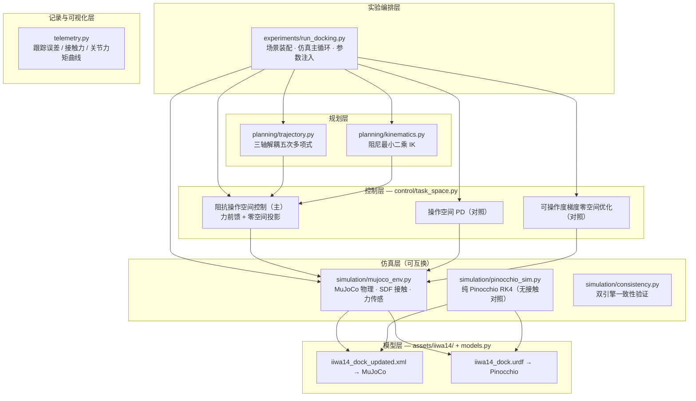
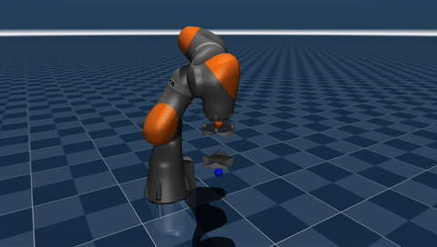

# KUKA iiwa14 柔顺对接仿真（MuJoCo × Pinocchio）

[](https://github.com/langxin11/compliant_docking_simulation/actions/workflows/ci.yml)

基于 **MuJoCo 物理仿真** 与 **Pinocchio 刚体动力学** 联动搭建的七轴机械臂（KUKA iiwa14）柔顺对接仿真平台。两个引擎完全独立、互不共享参数：MuJoCo 作为"物理世界"提供非凸 SDF 接触、末端六维力/力矩传感与渲染；Pinocchio 作为控制器内置的动力学模型提供质量矩阵、雅可比与逆运动学。二者在 **1 kHz** 闭环中协同运行，与真实机器人上部署模型基（model-based）控制器的结构完全一致。

## 亮点

### 1. Pinocchio × MuJoCo 双引擎联动仿真

| 引擎 | 职责 |
|---|---|
| **MuJoCo** | 物理积分（implicitfast，1 ms 步长）、SDF 非凸接触（elliptic 摩擦锥，`sdf_iterations=10`）、末端力/力矩传感、渲染与录制 |
| **Pinocchio** | 控制器侧动力学模型：CRBA 质量矩阵 `M`、Coriolis 矩阵 `C`、雅可比 `J` 及其时间导数 `J̇`、阻尼最小二乘逆运动学 |

每个控制周期（1 ms）的闭环数据流：

```
MuJoCo 状态 (q, v) ──► Pinocchio FK / J / M / C ──► 操作空间阻抗控制器 ──► 关节力矩 τ
      ▲                                                                        │
      └──────────────── MuJoCo mj_step ◄───────────────────────────────────────┘
                             │
                             └──► 力/力矩传感器 ──► 接触力前馈（旋转至世界系）
```

关键设计：控制器不依赖 MuJoCo 内部动力学——MuJoCo 只是被施加力矩的"黑盒物理世界"，接触力经虚拟传感器回读，如同真实机器人上的 F/T 传感器。这种解耦使同一套控制器可以无修改地迁移到纯 Pinocchio 仿真（`RobotSimulator`）或真实机器人。

双引擎联动的前提是动力学一致：`simulation/consistency.py` 在关节空间 PD 跟踪（五次多项式/正弦轨迹）下，将 Pinocchio 前向动力学（`pin.aba`）与 MuJoCo（`mj_step`）的结果交叉验证，确认两套模型同源，为联动闭环的可信度提供依据。

### 2. 分层抽象的软件架构



| 层 | 模块 | 职责 | 可替换性 |
|---|---|---|---|
| 实验编排层 | `experiments/run_docking.py` | 装配各层组件、运行仿真主循环 | — |
| 记录与可视化层 | `compliant_docking.telemetry` | 时序数据记录、位置跟踪/接触力/关节力矩绘图 | — |
| 控制层 | `compliant_docking.control.task_space` | 三组控制器实现（见下表） | 控制器间可切换对比 |
| 规划层 | `compliant_docking.planning`（`trajectory` / `kinematics`） | 三轴解耦五次多项式轨迹（端点速度/加速度为零）、DLS 逆运动学 | 任意轨迹发生器 |
| 仿真层 | `compliant_docking.simulation`（`mujoco_env` / `pinocchio_sim` / `consistency`） | MuJoCo 仿真封装、纯 Pinocchio RK4 仿真、双引擎验证 | 仿真器可互换 |
| 模型层 | `compliant_docking.models` + `assets/iiwa14/` | 同一套 mesh 的双描述：MuJoCo XML（主模型 `iiwa14_dock_updated.xml`）与 Pinocchio URDF，统一加载入口 | 换机器人只换模型层 |

各层之间只通过标准量（`q, v, τ, SE(3), J`）交互，替换任何一层不影响其它层——例如把 MuJoCo 仿真器换成纯 Pinocchio 仿真器做无接触验证、或在多组控制器之间切换做对比实验，都只改动编排层一行装配代码。

### 3. 柔顺对接任务与结果

场景：iiwa14 末端安装锥形对接头（SDF 非凸 mesh），对固定对接座沿 z 向下压完成对接。指令行程 18 cm，五次多项式轨迹 15 s，总仿真 18 s，控制频率 1 kHz。

- 操作空间阻抗控制 + 接触力前馈：接触后 Z 向按阻抗参数柔顺让位，无持续冲击；
- 接触回路保留 12 s 确定性安全回归：当前峰值约 **15.798 N**、12 s 时约
  **1.311 N**，且峰值硬性要求不超过旧基线 18.785 N；该回归不是最终对接精度验收；
- 非接触方向跟踪：X/Y 误差保持在 **±2 mm** 以内；
- 主循环含力矩限幅与异常捕获，接触丰富的场景下长时仿真稳定。


[](demo/docking.mp4)

## 控制器变体

`TaskSpaceController` 提供三组可切换实现，支撑多控制器对比实验：

| 方法 | 特点 |
|---|---|
| `compute_control_task_space_with_orientation_and_imp` | **主控制器**：位置/姿态双通道阻抗模型 `(m, d, k)` + 传感器接触力前馈；采用操作空间惯性 `Λ=(JM⁻¹Jᵀ)⁺`、动力学一致广义逆 `J̄=M⁻¹JᵀΛ` 与零空间投影 `N=I−J̄J`，通过 `Nᵀ` 注入关节阻尼抑制自运动 |
| `compute_control_task_space_with_orientation` | 纯操作空间 PD（无阻抗、无力前馈），作为对照 |
| `compute_control_task_space` | 位置子空间控制 + 可操作度（manipulability）梯度零空间优化，作为对照 |

另有两个独立控制器（与主控制器在 CLI 层三选一互换）：

- **`se3_lie`**（`control/se3_impedance.py`）：SE(3) Lie 群阻抗控制器
  （Kim et al. 2025, *IEEE T-RO* Vol. 41, §III-A）。不是"位置阻抗 + log3 姿态
  PD"——完整使用 `T̃=T⁻¹T_d`、六维指数坐标 `λ=log6(T̃)`、dexp 及其解析时间
  导数（`control/lie_se3.py`）、body Jacobian（`ReferenceFrame.LOCAL`）与
  body wrench（`wrench.py` 参考点平移变换）、等效有效 wrench 与惯量重塑
  A/D/K。7-DoF 以动力学一致广义逆替代论文的 J⁻¹。**未实现论文 §III-B 的
  NRIC 鲁棒内环**（留作后续）。`docking --controller se3_lie` 启用，
  详见[文档](docs/theory/se3_lie_impedance.md)。
- **`hqp`**（`control/hqp_ac.py`）：HQP-AC 约束自适应控制——把关节位置/速度/
  力矩极限作为 QP 硬约束（ZOH 短时域预测），刚度按接触力自适应，零空间做
  奇异性规避与关节位姿阻抗。`docking --controller hqp` 启用。
  出处：Ren & Shan 2026, Acta Astronautica, §3.2。

## 快速开始

```bash
git clone https://github.com/langxin11/compliant_docking_simulation.git
cd compliant_docking_simulation

uv sync                     # 创建环境并锁定依赖（uv.lock）
uv run docking --quick      # CLI 冒烟：2 s 仿真验证环境
uv run python experiments/run_docking.py   # 完整 18 s 对接仿真
```

先运行自由空间轨迹跟踪门禁，再进入柔顺对接：

```bash
# 2 s 冒烟只检查链路，结果标记为 INCOMPLETE，不作性能判定
uv run --frozen docking --scene scenes/iiwa14_tracking.yaml --quick

# 完整覆盖圆形与 8 字轨迹；PASS 返回 0，FAIL 返回 2
uv run --frozen docking --scene scenes/iiwa14_tracking.yaml --duration 13.1

# FR3 使用同一套门禁流程
uv run --frozen docking --scene scenes/fr3_tracking.yaml --duration 13.1
```

跟踪场景不装配母头，也不把 F/T 信号反馈给控制器，以隔离接触与柔顺控制影响；
但仍记录原始传感器、真实接触数和力矩限幅情况。圆形与 8 字轨迹在段间保持位置、
速度和加速度连续。验收阈值位于对应 `scenes/*_tracking.yaml` 的
`tracking_thresholds` 段，可按实际对接精度需求调整；完整运行只有同时满足分段误差、
姿态误差、力矩限幅比例和零接触要求才会输出 `PASS`。

当前 1 ms 步长、默认参数的确定性基线：iiwa14 圆/8 字位置 RMS 分别约
`0.236/0.269 mm`，FR3 分别约 `1.545/0.938 mm`；两者均无力矩限幅和接触。
这些结果只证明自由空间跟踪链路合格，不代表柔顺接触与最终对接精度已经验收。

运行测试：

```bash
uv run pytest -m "not slow" -q   # 快速单元测试（CI 同款）
uv run pytest -m slow -q         # 12 s 接触回归：锁定行为锚点（误差/接触力数值）
```

没有 uv 时也可以直接用 pip 安装依赖：

```bash
pip install mujoco pin numpy scipy matplotlib imageio imageio-ffmpeg
python experiments/run_docking.py
```

无显示器（headless）环境渲染：

```bash
sudo apt update && sudo apt install libegl1 libegl-dev
export MUJOCO_GL=egl
```

## 场景配置

`scenes/*.yaml` 用一份 YAML 描述完整对接场景：机械臂 + 公头工具 + 母头目标 + 物理参数 + 任务初始条件。三段 MJCF 片段在运行时经 MuJoCo **MjSpec attach** 组装为单一模型（`compliant_docking.scene.load_scene` → `Scene.build_mjmodel`），无需手工拼接 XML。

通过 CLI 的 `--scene` 参数选择场景：

```bash
uv run docking --scene scenes/iiwa14_docking.yaml --quick   # iiwa14 对接（默认场景）
uv run docking --scene scenes/fr3_docking.yaml --quick      # FR3 对接
```

可选机械臂：

- **KUKA iiwa14**（URDF）：MuJoCo 用 `assets/iiwa14/iiwa14_arm.xml`，Pinocchio 读 URDF `iiwa14_dock.urdf`；
- **Franka FR3**（mujoco_menagerie 派生的力矩执行器 MJCF 变体）：MuJoCo 与 Pinocchio 均直读 `assets/fr3/fr3_arm.xml`——`load_pin_model` 按文件后缀分发解析器（`.urdf` 走 URDF，`.xml` 走 `buildModelFromMJCF`）。

新增场景：复制一份现有 YAML，替换 `robot` 段的资产路径与 `task` 段的初始条件（`ik_guess` 换成新机械臂的 home 位形）即可；公头/母头片段可直接复用 `assets/interfaces/` 下的 `male_cone.xml` / `female_socket.xml`。

### 摩擦前馈模式

带关节摩擦的机械臂默认使用 **`torque` 模式**摩擦前馈：`τ_ff = f·tanh(τ_pre/(f/2))`——用补偿前力矩方向决定摩擦方向，力矩一出即被抬过静摩擦阈值，治零速死区粘滑（实测 FR3 对接：接触前横向偏差 5.2→2.1 mm，速度比振荡 0.10–3.91→0.35–1.20，接触峰值轴向力 37.4→27.2 N）。零摩擦机械臂下两模式等价。

场景级开关 `friction_comp:` 可切回 **`velocity` 模式**（`τ_ff = f·tanh(q̇/0.01)`，运动中补偿精确）：快速自由空间跟踪属于这种工况，`fr3_tracking` 场景显式钉在该模式——其 5 mm 门禁基线在 velocity 下校准。

### 无传感器 HQP-AC 与接触预紧

`hqp:` 场景段可切换外力来源与预紧：`force_source: observer` 用 PI 动量观测器
（Ren & Shan 2026 Eq.23-25，残差扣除已知耗散模型后的纯接触估计）替代 F/T 传感器；
`preload_force` 在检测到接触后沿 stroke 方向斜坡保持期望接触力（解决纯阻抗
"轻触即停"无预紧）。`contact_deadband` 需高于静摩擦导致的估计地板（FR3 取 8 N）。

实测（FR3 对接）：观测器模式与传感器模式行为一致（首触 17.1s/峰值 5.25 N/终态 21.0 mm）；
观测器+5N 预紧实现稳态接触力 5.22 N（目标 5.0）、插入深度恢复到 14.9 mm。
场景样例：`scenes/fr3_docking_sensorless.yaml`。

### SE(3)-TOPP 规划器

`trajectory: {type: se3topp}` 启用 Ren & Shan 2026 §3.1 的 SE(3) 分段测地线 +
时间最优参数化轨迹（Theorem 1 的体坐标线性映射 + 解析梯形/三角形剖面，
角速度/角加速度限幅经 `omega_max_*` / `alpha_max_*` 字段配置）。与两段式
五次曲线同限速下时间更优：iiwa14 对接场景总时长 10.9→6.7 s（-39%），接触
峰值力不变（7.83→7.92 N）。姿态路径与角速度限幅已实现并有测试；按步姿态
参考跟踪（时变 r_des）待控制接口扩展。

## 框架对比研究

复现 Ren & Shan 2026 §4.2.3 的对比设计（2×2 配置矩阵：{单段五次, 两段式} × {CIC 阻抗, HQP-AC}，Table 10 三层指标）：

```bash
MUJOCO_GL=egl uv run python experiments/compare_frameworks.py            # 默认两个对接场景
MUJOCO_GL=egl uv run python experiments/compare_frameworks.py --scene scenes/fr3_docking.yaml
```

结果打印对比表并写入 `results/framework_comparison_<场景>.md`，同时生成接触力时序与接触指标柱状图到 `figure/framework_comparison/`。

## 绘图风格

项目绘图统一走 [SciencePlots](https://github.com/garrettj403/SciencePlots) 的 `["science", "ieee", "no-latex"]` 风格（IEEE 单栏、不依赖 LaTeX），并叠加 Noto CJK 中文字体回退与 `axes.unicode_minus=False`（规避中文字体缺 U+2212 负号的问题）。入口：`compliant_docking.plotting.apply_style()` 与 `plot_docking_log(log, out_dir, scene_name=...)`，每张图同时输出 PNG + PDF。运行 `docking --scene ...` 完成后图件按场景归档在 `figure/<场景名>/`（如 `figure/iiwa14_docking/`），文件名带场景前缀。

## 仓库结构

```
├── src/compliant_docking/          # 核心 Python 包
│   ├── models.py                   # 模型层入口：XML/URDF 路径与加载（重力置零统一管理）
│   ├── config.py                   # ImpedanceConfig / DockingConfig：参数集中管理
│   ├── cli.py                      # docking 命令行入口（uv run docking）
│   ├── planning/
│   │   ├── trajectory.py           # 三轴解耦五次多项式轨迹
│   │   └── kinematics.py           # 阻尼最小二乘逆运动学
│   ├── control/
│   │   └── task_space.py           # 操作空间控制器（三组可切换实现）
│   ├── simulation/
│   │   ├── mujoco_env.py           # MuJoCo 封装（step / 传感器 / 渲染 / 录制）
│   │   ├── pinocchio_sim.py        # 纯 Pinocchio RK4 仿真器（无接触对照）
│   │   └── consistency.py          # 双引擎动力学一致性验证
│   └── telemetry.py                # 数据记录与结果绘图
├── experiments/
│   ├── run_docking.py              # 对接任务编排：场景装配 + 仿真主循环
│   └── check_env.py                # 仿真环境自检脚本
├── assets/iiwa14/                  # 模型资产：MuJoCo XML 与 Pinocchio URDF（同一套 mesh）
│   ├── iiwa14_dock_updated.xml     # 主仿真模型：SDF 对接头/对接座 + 力传感器
│   └── iiwa14_dock.urdf            # Pinocchio 动力学计算用
├── tests/                          # pytest 测试
├── docs/                           # 理论文档（见"延伸阅读"）
└── demo/                           # 演示视频与结果图
```

## 文档

完整文档（架构总览、论文-代码对照表、理论推导、实验复现手册、自动生成 API 参考）基于
MkDocs（Material 主题 + mkdocstrings）构建，源文件在 `docs/`：

```bash
uv run mkdocs serve   # 本地预览 http://127.0.0.1:8000
uv run mkdocs build   # 静态站点输出 site/
```

## 延伸阅读

- [docs/main_simulation_theory_and_flow.md](docs/main_simulation_theory_and_flow.md) —— 控制理论基础与端到端数据流梳理，附关键代码锚点
- [docs/机械臂阻抗控制.md](docs/机械臂阻抗控制.md) —— 关节空间阻抗控制推导（期望阻抗模型与控制律设计）

## License

MIT
