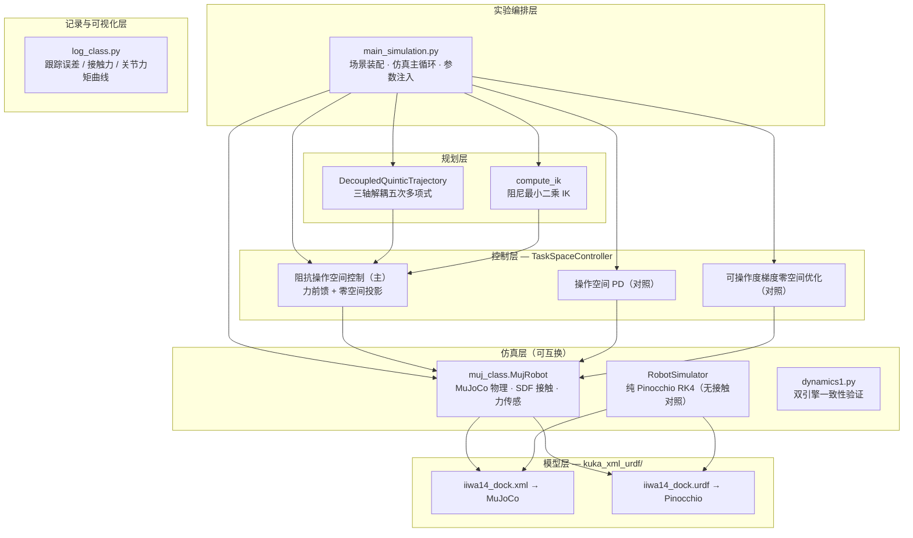

# KUKA iiwa14 柔顺对接仿真（MuJoCo × Pinocchio）

基于 **MuJoCo 物理仿真** 与 **Pinocchio 刚体动力学** 联动搭建的七轴机械臂（KUKA iiwa14）柔顺对接仿真平台。两个引擎完全独立、互不共享参数：MuJoCo 作为"物理世界"提供非凸 SDF 接触、末端六维力/力矩传感与渲染；Pinocchio 作为控制器内置的动力学模型提供质量矩阵、雅可比与逆运动学。二者在 **1 kHz** 闭环中协同运行，与真实机器人上部署模型基（model-based）控制器的结构完全一致。

## 亮点

### 1. Pinocchio × MuJoCo 双引擎联动仿真

| 引擎 | 职责 |
|---|---|
| **MuJoCo** | 物理积分（implicitfast，1 ms 步长）、SDF 非凸接触（elliptic 摩擦锥，`sdf_initpoints=200`）、末端力/力矩传感、渲染与录制 |
| **Pinocchio** | 控制器侧动力学模型：CRBA 质量矩阵 `M`、Coriolis 矩阵 `C`、雅可比 `J` 及其时间导数 `J̇`、阻尼最小二乘逆运动学 |

每个控制周期（1 ms）的闭环数据流：

```
MuJoCo 状态 (q, v) ──► Pinocchio FK / J / M / C ──► 操作空间阻抗控制器 ──► 关节力矩 τ
      ▲                                                                        │
      └──────────────── MuJoCo mj_step ◄───────────────────────────────────────┘
                             │
                             └──► 力/力矩传感器 ──► 接触力前馈（旋转至世界系）
```

关键设计：控制器不依赖 MuJoCo 内部动力学——MuJoCo 只是被施加力矩的"黑盒物理世界"，接触力经虚拟传感器回读，如同真实机器人上的 F/T 传感器。这种解耦使同一套控制器可以无修改地迁移到纯 Pinocchio 仿真（`RobotSimulator`）或真实机器人。

双引擎联动的前提是动力学一致：`dynamics1.py` 在关节空间 PD 跟踪（五次多项式/正弦轨迹）下，将 Pinocchio 前向动力学（`pin.aba`）与 MuJoCo（`mj_step`）的结果交叉验证，确认两套模型同源，为联动闭环的可信度提供依据。

### 2. 分层抽象的软件架构



| 层 | 模块 | 职责 | 可替换性 |
|---|---|---|---|
| 实验编排层 | `main_simulation.py` | 装配各层组件、运行仿真主循环 | — |
| 记录与可视化层 | `log_class.py` | 时序数据记录、位置跟踪/接触力/关节力矩绘图 | — |
| 控制层 | `Relate_class.TaskSpaceController` | 三组控制器实现（见下表） | 控制器间可切换对比 |
| 规划层 | `DecoupledQuinticTrajectory` / `compute_ik` | 三轴解耦五次多项式轨迹（端点速度/加速度为零）、DLS 逆运动学 | 任意轨迹发生器 |
| 仿真层 | `MujRobot` / `RobotSimulator` / `dynamics1.py` | MuJoCo 仿真封装、纯 Pinocchio RK4 仿真、双引擎验证 | 仿真器可互换 |
| 模型层 | `kuka_xml_urdf/` | 同一套 mesh 的双描述：MuJoCo XML 与 Pinocchio URDF | 换机器人只换模型层 |

各层之间只通过标准量（`q, v, τ, SE(3), J`）交互，替换任何一层不影响其它层——例如把 MuJoCo 仿真器换成纯 Pinocchio 仿真器做无接触验证、或在多组控制器之间切换做对比实验，都只改动编排层一行装配代码。

### 3. 柔顺对接任务与结果

场景：iiwa14 末端安装锥形对接头（SDF 非凸 mesh），对固定对接座沿 z 向下压完成对接。指令行程 18 cm，五次多项式轨迹 15 s，总仿真 18 s，控制频率 1 kHz。

- 操作空间阻抗控制 + 接触力前馈：接触后 Z 向按阻抗参数柔顺让位，无冲击尖峰；
- 接触力（MuJoCo 力传感器实测）：稳态约 **2.5 N**，瞬态峰值约 **2.7 N**；
- 非接触方向跟踪：X/Y 误差保持在 **±2 mm** 以内。


[](demo/docking.mp4)

## 控制器变体

`TaskSpaceController` 提供三组可切换实现，支撑多控制器对比实验：

| 方法 | 特点 |
|---|---|
| `compute_control_task_space_with_orientation_and_imp` | **主控制器**：位置/姿态双通道阻抗模型 `(m, d, k)` + 传感器接触力前馈；任务空间→关节空间映射采用 `M⁻¹` 加权伪逆并构造零空间投影算子 `N = I − ΛJ M⁻¹`，零空间注入阻尼抑制自运动 |
| `compute_control_task_space_with_orientation` | 纯操作空间 PD（无阻抗、无力前馈），作为对照 |
| `compute_control_task_space` | 位置子空间控制 + 可操作度（manipulability）梯度零空间优化，作为对照 |

## 快速开始

```bash
git clone https://github.com/langxin11/compliant_docking_simulation.git
cd compliant_docking_simulation

conda create -n pin_mjcf python=3.10
conda activate pin_mjcf
pip install pin                # Pinocchio（Linux）
pip install -r requirement.txt

python main_simulation.py
```

无显示器（headless）环境渲染：

```bash
sudo apt update && sudo apt install libegl1 libegl-dev
export MUJOCO_GL=egl
```

## 仓库结构

```
├── main_simulation.py      # 实验编排层：场景装配 + 仿真主循环
├── Relate_class.py         # 规划层 + 控制层：轨迹、IK、操作空间控制器、纯 Pinocchio 仿真器
├── muj_class.py            # 仿真层：MuJoCo 封装（step / 传感器 / 渲染 / 录制）
├── log_class.py            # 记录层：数据记录与结果绘图
├── dynamics1.py            # 双引擎动力学一致性验证
├── kuka_xml_urdf/          # 模型层：MuJoCo XML 与 Pinocchio URDF（同一套 mesh）
│   ├── iiwa14_dock.xml     # 含 SDF 对接头/对接座与力传感器定义
│   └── iiwa14_dock.urdf
├── demo/                   # 演示视频与结果图
└── figure/                 # 最近一次运行输出
```

## License

MIT
