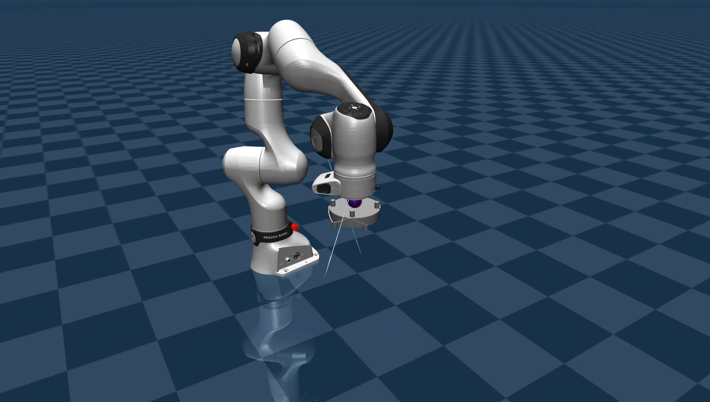
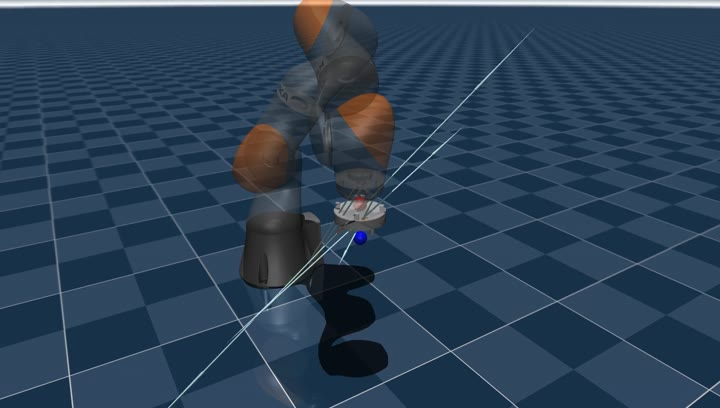
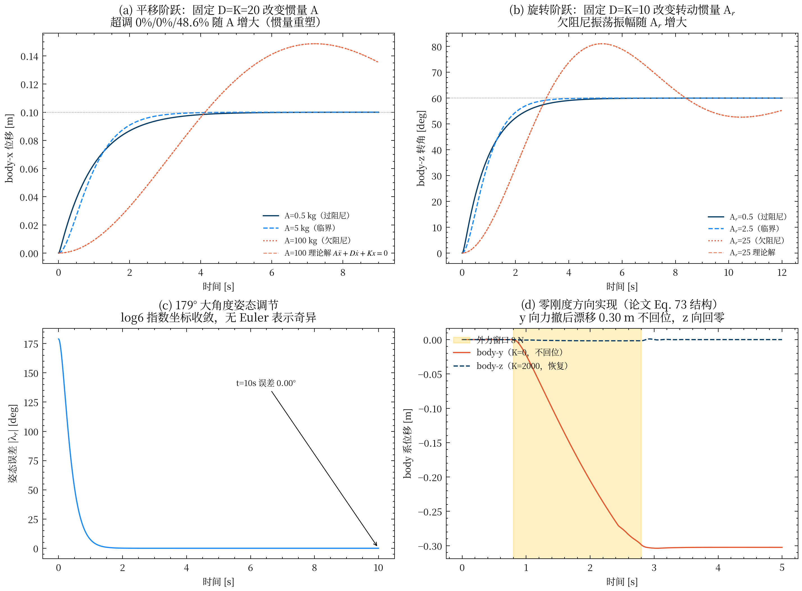
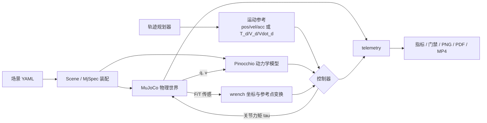

# Compliant Docking Simulation

[](https://github.com/langxin11/compliant_docking_simulation/actions/workflows/ci.yml)

[](LICENSE)

面向七自由度机械臂的柔顺对接研究与复现实验平台。项目以 **MuJoCo** 作为独立物理世界、以
**Pinocchio** 作为控制器侧动力学模型，在 1 kHz 闭环中统一比较经典任务空间阻抗、
SE(3) Lie 群阻抗和 HQP-AC，并提供轨迹规划、无传感器外力估计、跟踪门禁、指标统计与可复现图表。

当前内置 **KUKA iiwa14** 与 **Franka FR3** 两套机器人场景；模型、控制器和实验编排彼此解耦，
便于替换机械臂、对接接口或控制算法。

## 演示

点击预览图可播放完整 MP4。视频均由仓库内场景和控制器直接生成。
新录制视频会叠加青色规划点列、绿色当前期望点、橙色实际末端采样点，以及接触阶段的浅青色力箭头。

| iiwa14 经典阻抗对接 | FR3 摩擦场景对接 | iiwa14 SE(3) Lie 对接 |
|---|---|---|
| [](demo/docking.mp4) | [](demo/fr3_docking.mp4) | [](demo/se3_lie_docking.mp4) |

SE(3) 自由空间实验复现了平移/旋转惯量重塑、179° 大角度姿态调节和零刚度方向：



## 核心能力

| 能力 | 实现 |
|---|---|
| 双引擎闭环 | MuJoCo 负责接触、传感与积分；Pinocchio 负责 `M/C/J/Jdot`、IK 与逆动力学 |
| 三类控制器 | `impedance`、`se3_lie`、`hqp` 通过同一 CLI 切换 |
| SE(3) 运动参考 | 位姿 `T_d`、body twist `V_d` 和 `Vdot_d` 按步传递；兼容 SE(3)-TOPP 与纯位置轨迹 |
| 规划器 | 单段/两段五次、圆与 8 字跟踪、SE(3) 测地线与解析时间最优剖面 |
| 接触与外力 | 六维 F/T 传感、body/world wrench 变换、PI 动量观测器、接触预紧 |
| 工程化验收 | 自由空间 PASS/FAIL 门禁、接触安全/内部安全/跟踪精度三层指标、确定性回归测试 |
| 可复现输出 | IEEE 风格 PNG/PDF、MP4 录制、框架对比表和完整 MkDocs 文档 |

## 快速开始

推荐使用 [uv](https://docs.astral.sh/uv/)：

```bash
git clone https://github.com/langxin11/compliant_docking_simulation.git
cd compliant_docking_simulation
uv sync --dev

# 2 s 链路冒烟；不作为性能验收
uv run docking --quick

# 完整默认对接实验（iiwa14 + 经典阻抗）
uv run docking
```

没有 uv 时可使用标准虚拟环境；项目依赖由 `pyproject.toml` 统一维护：

```bash
python -m venv .venv
source .venv/bin/activate
python -m pip install -e .
docking --quick
```

无显示环境建议启用 EGL：

```bash
MUJOCO_GL=egl uv run docking --scene scenes/fr3_docking.yaml
```

系统需提供 EGL 运行库；Ubuntu 可安装 `libegl1` 与 `libegl-dev`。

## 选择控制器

```bash
# 经典固定增益任务空间阻抗（默认）
uv run docking --controller impedance

# Kim et al. 2025 §III-A：SE(3) Lie 群阻抗
uv run docking --controller se3_lie

# Ren & Shan 2026 §3.2：带硬约束与自适应刚度的 HQP-AC
uv run docking --controller hqp
```

| CLI 名称 | 核心特征 | 坐标系与约束 |
|---|---|---|
| `impedance` | 位置/姿态双通道阻抗、接触力前馈、动力学一致零空间阻尼 | `LOCAL_WORLD_ALIGNED`；运行期软限幅 |
| `se3_lie` | `T~ = T^-1 T_d`、`log6`、完整 `dexp`/时间导数、六维 A/D/K 惯量重塑 | body Jacobian + body wrench；7-DoF 动力学一致广义逆 |
| `hqp` | 自适应刚度、奇异性规避、关节位姿任务、传感器/观测器外力切换 | 关节位置、速度和力矩 QP 硬约束 |

`se3_lie` 实现的是论文的标称控制器，**不包含** Kim et al. §III-B 的 NRIC 鲁棒内环。
数学约定、有限差分 oracle 和已知边界见
[SE(3) Lie 群阻抗控制器文档](docs/theory/se3_lie_impedance.md)。

## 推荐验收流程

先运行自由空间门禁，再运行接触对接：

```bash
# 完整覆盖圆形和 8 字轨迹；PASS=0，FAIL=2
uv run --frozen docking --scene scenes/iiwa14_tracking.yaml --duration 13.1
uv run --frozen docking --scene scenes/fr3_tracking.yaml --duration 13.1

# 对接场景
uv run --frozen docking --scene scenes/iiwa14_docking.yaml
uv run --frozen docking --scene scenes/fr3_docking.yaml
```

默认 1 ms 步长下，自由空间位置 RMS 基线为：iiwa14 圆/8 字约
`0.236/0.269 mm`，FR3 约 `1.545/0.938 mm`；两者均无接触和力矩饱和。
这些数值只验收自由空间跟踪链路，不等同于最终对接精度。

SE(3) Lie 控制器的独立动力学渲染实验：

```bash
# 五组 PASS/FAIL 实验；--quick 可做短时检查
uv run python experiments/se3_free_space.py

# 重跑核心实验并生成 figure/se3_free_space/ 下的 PNG/PDF
uv run python experiments/se3_free_space_plots.py
```

框架对比研究：

```bash
MUJOCO_GL=egl uv run python experiments/compare_frameworks.py
MUJOCO_GL=egl uv run python experiments/compare_frameworks.py \
  --scene scenes/fr3_docking.yaml
```

结果写入 `results/framework_comparison_*.md`，图件写入 `figure/framework_comparison/`。
完整命令、阈值和基线见[实验复现手册](docs/experiments.md)。

## 架构



关键边界是：控制器不读取 MuJoCo 的内部动力学量。MuJoCo 只接收关节力矩并返回状态与传感器
数据，Pinocchio 独立计算控制所需模型量。这与真实机器人上“物理本体 + 模型基控制器”的部署
结构一致。`simulation/consistency.py` 通过质量矩阵和前向动力学交叉验证保证两套模型同源。

## 场景与配置

场景文件位于 `scenes/`，一份 YAML 描述机器人、工具、目标、物理参数、任务初值和可选控制器
覆盖参数。运行时通过 MuJoCo `MjSpec.attach` 装配机械臂、公头和母头，无需维护重复的整机 XML。

```bash
uv run docking --scene scenes/iiwa14_docking.yaml --controller se3_lie
uv run docking --scene scenes/fr3_docking.yaml --controller hqp
uv run docking --scene scenes/fr3_docking_sensorless.yaml --controller hqp
```

- **iiwa14**：MuJoCo 使用机械臂 MJCF，Pinocchio 使用臂与工具组合 URDF；零摩擦，承担确定性锚点。
- **FR3**：两侧均从 MJCF 构建，保留真实减速器摩擦；用于摩擦前馈、观测器和接触预紧实验。
- `friction_comp: torque|velocity` 控制摩擦前馈方向语义。
- `se3_impedance:` 可覆盖六维 `A/D/K` 对角参数和零空间阻尼。
- `hqp:` 可配置外力来源、观测器增益、死区与预紧力。
- `trajectory.type` 支持 `twophase`、`se3topp` 和 `tracking`；省略该段使用历史单段五次轨迹。

SE(3)-TOPP 已能按步输出完整位姿和 body 运动参考，并已接入 `se3_lie` 控制链路。当前内置对接
场景仍使用 `final_ori = init_ori`，因此时变姿态接口已有单元测试和接线验证，但尚未提供专门的
时变姿态对接场景基线。

## 仓库结构

```text
├── assets/                         # iiwa14、FR3 与公头/母头模型资产
├── scenes/                         # 对接、跟踪、无传感器场景 YAML
├── src/compliant_docking/
│   ├── control/                    # CIC、SE(3) Lie、HQP-AC、摩擦与动量观测器
│   ├── planning/                   # 五次/跟踪轨迹、SE(3)-TOPP、运动参考适配、IK
│   ├── simulation/                 # MuJoCo、Pinocchio RK4 与双引擎一致性验证
│   ├── scene.py                    # 场景解析与 MjSpec 装配
│   ├── wrench.py                   # wrench 坐标系与参考点变换
│   ├── metrics.py                  # 对接指标与自由空间门禁
│   ├── plotting.py                 # 统一 IEEE 绘图样式
│   └── telemetry.py                # 时序与 SE(3) 诊断记录
├── experiments/
│   ├── run_docking.py              # 主仿真编排
│   ├── compare_frameworks.py       # 2x2 框架对比
│   ├── se3_free_space.py           # SE(3) 自由空间验收
│   └── se3_free_space_plots.py     # SE(3) 验证图生成
├── tests/                          # 数学 oracle、集成、门禁和慢速接触回归
├── docs/                           # MkDocs 文档源文件
├── demo/                           # README 使用的受版本控制媒体
└── results/                        # 已提交的框架对比结果表
```

## 测试与开发

```bash
# CI 同款：静态检查 + 非慢速测试
uv run ruff check .
uv run pytest -m "not slow" -q

# 12 s 接触回归；用于锁定误差和接触力数值锚点
uv run pytest -m slow -q

# 文档严格构建
uv run mkdocs build --strict
```

数值稳定性相关实现不只依赖期望值测试：Lie 群工具包含有限差分、矩阵恒等式、Adjoint 共轭、
功率守恒和近 π/小角度分支测试；wrench 变换验证力矩平移与虚功率不变性。

## 文档

- [架构总览](docs/architecture.md)
- [实验复现手册](docs/experiments.md)
- [论文—代码对照](docs/paper_mapping.md)
- [阻抗控制基础](docs/theory/impedance_control.md)
- [SE(3) Lie 群阻抗控制器](docs/theory/se3_lie_impedance.md)
- [主仿真理论与数据流](docs/theory/simulation_flow.md)
- [控制器 API](docs/api/control.md) · [规划器 API](docs/api/planning.md) · [核心模块 API](docs/api/core.md)

本地预览：

```bash
uv run mkdocs serve
```

## 研究边界

- 目前是仿真研究平台，不包含 ROS 2 驱动，也未在真实机器人上验证。
- `se3_lie` 未实现 Kim et al. 2025 §III-B 的 NRIC 鲁棒内环。
- `log6` 使用主对数分支；大角度测试覆盖 179°，不声称跨越 SE(3) 对数映射的单射半径。
- 生成的 `figure/`、`video/` 和 `runs/` 默认不纳入版本控制；README 媒体是从可复现实验中挑选的快照。

## 参考工作

- J. Kim et al., “Impedance Control Design Framework Using Commutative Map Between SE(3) and se(3),” *IEEE Transactions on Robotics*, 2025.
- Ren & Shan, unified compliant control and trajectory-planning framework, *Acta Astronautica*, 2026.

## License

[MIT](LICENSE)
