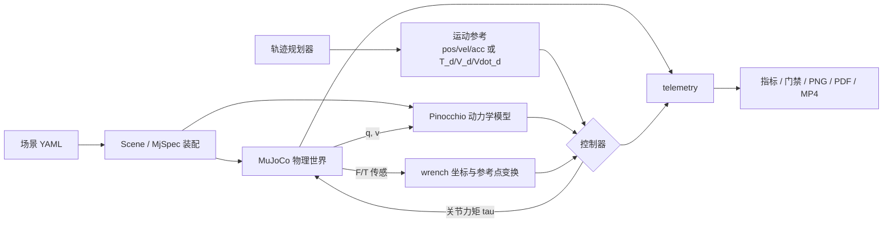

# Compliant Docking Simulation

[](https://github.com/langxin11/compliant_docking_simulation/actions/workflows/ci.yml)

[](LICENSE)

本项目面向机器人模块化在轨装配中的**柔顺对接**问题，建立一个可以研究轨迹规划、
柔顺控制、接口接触以及完整装配流程的可复现仿真平台。MuJoCo 提供物理世界，
Pinocchio 提供运动学与控制侧刚体动力学；内置 KUKA iiwa14 与 Franka FR3。

项目起源于 Ren & Shan（2026, Acta Astronautica）规划—柔顺控制统一框架的复现，
随后加入 Kim et al.（2025, IEEE T-RO）的 SE(3) 阻抗控制、Petal / Crown / angle1 等
几何导向接口，以及 HexFrame 完整组装任务，逐步从论文复现成长为自己的研究平台。
这段历史见[项目演化](docs/project_evolution.md)。

当前主线（2026-10 收束）：在声明的定位误差与固定模型条件下，柔顺策略对对接完成、
最终误差、完成时间与失败边界的影响，以及如何接入完整装配，见
[研究主线](docs/research_focus.md)。这一主线的机制表述是 **geometry-informed
selective compliance（几何引导的自由度选择性柔顺）**——接触以后哪些自由度应保持
约束、哪些应允许接口被动自对准；该表述来自收束期间的讨论与文档整理，不是项目
立项时的研究目标。实验中把自对准方向刚度释放到 0 是分离机制的极端对照，不是理论
最优刚度为零的主张，见[选择性柔顺](docs/theory/selective_compliance.md)。

## 🧭 三层研究结构

| 层次 | 核心问题 | 入口与说明 |
|---|---|---|
| 研究对象与物理基线 | 我们在什么模型、接口和接触条件下研究？ | [模型基线](docs/models_interfaces.md)、`experiments/models_interfaces/` |
| 对接方法与接触柔顺 | 我们怎样控制机器人完成对接？ | [论文对照](docs/paper_mapping.md)、[RQ1/RQ2 协议](docs/control_research.md)、`experiments/control/` |
| 完整装配与系统验证 | 单接口上的策略进入完整装配流程后是否仍有效？ | [系统验证](docs/system_validation.md)、`experiments/system/` |

第二层覆盖方法层面的三个问题，前两个来自主要参考文献：

1. 在轨机器人进行模块对接时，怎样把轨迹规划和柔顺控制统一起来，使整个接触装配
   过程既能完成，又满足安全约束？（Ren & Shan，复现于 SE(3)-TOPP + HQP-AC）
2. 机器人末端位姿本来位于非欧氏的 SE(3) 空间中，怎样才能用最小参数、保持正确
   几何结构，并且系统地设计一个真正的六自由度阻抗控制器？（Kim et al.，复现于
   `se3_lie` §III-A 标称阻抗）
3. 接触以后，各自由度的柔顺应怎样按接口几何分配？（当前机制表述，收束期间引入）

三层结构是当前为了建立清晰证据边界采用的研究组织方式，不是项目的开发顺序。
单接口默认采用 `angle1_blend030` 凸块模型（物理/控制/反馈延迟均为 1 ms），
入口为 `scenes/iiwa14_petal_insertion.yaml`；HexFrame 正式场景仍用旧接口。

## 🚀 安装与冒烟

```bash
git clone https://github.com/langxin11/compliant_docking_simulation.git
cd compliant_docking_simulation
uv sync --frozen --dev        # 推荐 uv；标准环境可用 python -m pip install -e .
uv run docking --quick        # 2 s 链路检查，不代表完整验收
uv run pytest -m 'not slow' -q
```

无显示环境设 `MUJOCO_GL=egl`；Ubuntu 需要 `libegl1`、`libegl-dev`。

## 🧪 三类实验怎么跑

```bash
# 模型与接口：固定基线的双引擎、关节与初始接触检查
uv run python -m experiments.models_interfaces.baseline --out runs/model_baseline_my_run

# RQ1：固定接口，仅比较绕轴策略
OPENBLAS_NUM_THREADS=1 uv run python -m experiments.control.rq1_yaw \
  --case combined --setting baseline --out runs/rq1_my_run

# RQ2：固定绕轴释放，同点比较保持/释放 XY
OPENBLAS_NUM_THREADS=1 uv run python -m experiments.control.rq2_lateral \
  --stage paired --out runs/rq2_my_run --jobs 3

# 系统：完整 53 s HexFrame 装配 + 独立审计；同目录可回放生成视频
OPENBLAS_NUM_THREADS=1 MUJOCO_GL=egl uv run python -m experiments.system.hexframe \
  accept --out runs/hexframe_my_run
```

一个实验回答一个问题；每次运行使用 `runs/` 下的新目录。控制研究读各组 JSON 的
`assessment`（计算完成不等于对照组全通过）；系统验收要求 `validation.json` 与独立
`audit.json` 均通过，预检为 `INCOMPLETE`。完整命令、退出语义与历史研究入口见
[实验复现手册](docs/experiments.md)。

## 📊 去哪里看结果

- `results/` —— 冻结的轻量结论摘要与支撑图表，按原协议解释，不续写旧结果。
- `docs/control_main_results.md` —— 当前控制主结果与失败边界。
- `docs/historical_evidence.md` —— 按问题分类的历史证据索引。
- 新运行数据一律写 `runs/`（Git 忽略）。

## 🎬 演示

| iiwa14 经典阻抗 | FR3 摩擦场景 | iiwa14 SE(3) Lie |
|---|---|---|
| [](demo/docking.mp4) | [](demo/fr3_docking.mp4) | [](demo/se3_lie_docking.mp4) |

SE(3) 自由空间验证覆盖惯量重塑、179° 姿态与零刚度方向：


## 🧱 仿真架构


```mermaid
flowchart LR
    YAML[场景 YAML] --> SCENE[Scene / MjSpec 装配]
    SCENE --> MJ[MuJoCo 物理世界]
    SCENE --> PIN[Pinocchio 动力学模型]
    PLAN[轨迹规划器] --> REF[运动参考<br/>pos/vel/acc 或 T_d/V_d/Vdot_d]
    REF --> CTRL{控制器}
    PIN --> CTRL
    CTRL -->|关节力矩 tau| MJ
    MJ -->|q, v| PIN
    MJ -->|F/T 传感| W[wrench 坐标与参考点变换]
    W --> CTRL
    MJ --> LOG[telemetry]
    CTRL --> LOG
    LOG --> OUT[指标 / 门禁 / PNG / PDF / MP4]
```

关键边界是：控制器不读取 MuJoCo 的内部动力学量。MuJoCo 只接收关节力矩并返回
状态与传感器数据，Pinocchio 独立计算控制所需模型量，与真实机器人上
“物理本体 + 模型基控制器”的部署结构一致；`simulation/consistency.py`
通过质量矩阵和前向动力学交叉验证保证两套模型同源。
模块职责与 SE(3) body 数据流详见[架构总览](docs/architecture.md)。

## 📚 目录与文档

```text
assets/                          模型资产、许可与来源记录（唯一来源）
scenes/                          声明物理与控制配置的场景
experiments/models_interfaces/   模型资格检查、接口候选与几何编排
experiments/control/             RQ1/RQ2、误差范围与自由空间验证
experiments/system/              HexFrame 正式验收、预检、回放与 P0/P1/P2 扩展
src/compliant_docking/           共享模型、控制、规划、仿真与系统实现
tests/                           数学、配置与行为回归
results/                         冻结的轻量研究证据
demo/                            精选展示图件与视频
runs/                            本地运行输出（Git 忽略）
```

建议阅读顺序：[项目演化](docs/project_evolution.md) → [当前研究主线](docs/research_focus.md) →
[研究范围与三层结构](docs/research_scope.md) → [阻抗控制基础](docs/theory/impedance_control.md) →
[SE(3) Lie 阻抗](docs/theory/se3_lie_impedance.md) → [选择性柔顺](docs/theory/selective_compliance.md) →
[RQ1/RQ2 协议](docs/control_research.md) → [控制主结果](docs/control_main_results.md) →
[HexFrame 系统验证](docs/system_validation.md)。在线文档见
[langxin11.github.io/compliant_docking_simulation](https://langxin11.github.io/compliant_docking_simulation/)；
其他入口：[架构](docs/architecture.md) · [实验复现手册](docs/experiments.md) ·
[论文对照](docs/paper_mapping.md) · [API](docs/api/control.md)。
编码代理先读 [AGENTS.md](AGENTS.md)；贡献与检查要求见
[贡献指南](CONTRIBUTING.md)与[变更记录](CHANGELOG.md)。

## 许可与参考

项目代码使用 [MIT](LICENSE)，导入资产遵循各资产目录内的许可与来源清单。
控制方法参考 Ren & Shan (2026, Acta Astronautica) 与 Kim et al. (2025, IEEE T-RO)；
SE(3) 部分实现的是 Kim 论文的 §III-A 标称阻抗，§III-B NRIC 未实现，
对应关系见[论文对照](docs/paper_mapping.md)。项目目前仅有仿真证据，未验证实机、
制造公差或真实锁紧。
