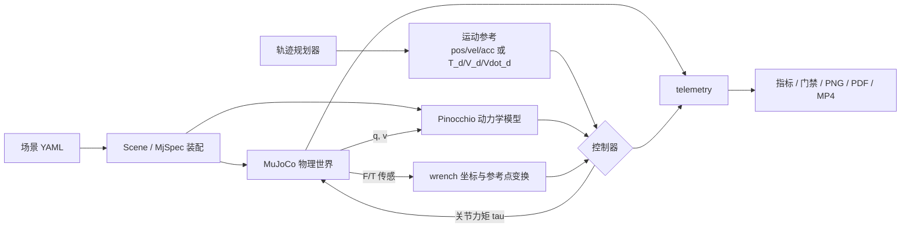

# Compliant Docking Simulation

[](https://github.com/langxin11/compliant_docking_simulation/actions/workflows/ci.yml)

[](LICENSE)

本项目面向机器人模块化在轨装配中的**柔顺对接**问题，建立一个覆盖轨迹规划、
柔顺控制、接口接触以及完整装配流程的可复现仿真平台。MuJoCo 提供物理世界，
Pinocchio 提供运动学与控制侧刚体动力学；内置 KUKA iiwa14 与 Franka FR3。

本项目**以论文复现为基础**：复现 Ren & Shan（2026, Acta Astronautica）在轨装配的
规划—柔顺控制统一框架（SE(3)-TOPP 规划器 + HQP-AC 控制器）与 Kim et al.
（2025, IEEE T-RO）的 SE(3) 阻抗控制设计框架（§III-A 标称阻抗），逐条对照见
[论文对照](docs/paper_mapping.md)。在此基础上适当拓展：PetalDock / angle1 等
几何导向接口与交互调形工具（[接口交互调形](docs/petal_designer.md)）、绕轴释放与
横向释放两组小型接触机制实验，以及 HexFrame 完整装配演示。演化过程见
[项目演化](docs/project_evolution.md)。

绕轴释放与横向释放实验分析典型定位误差下刚度设置与卡滞之间的关系；其中释放到
零刚度是移除恢复力的极端实验点，不是最优刚度为零的主张。仓库按三层组织已有能力，
组织说明与证据规则见[研究组织与范围](docs/research_scope.md)。

## 🧭 三层组织结构

| 层次 | 定位 | 内容与入口 |
|---|---|---|
| 模型与接口 | 仿真平台基线 | 模型一致性、接口几何、接触模型——[模型基线](docs/models_interfaces.md)、`experiments/models_interfaces/` |
| 规划与柔顺控制 | 论文复现与控制实验 | SE(3)-TOPP、阻抗、HQP-AC、SE(3) impedance、绕轴/横向释放实验——[论文对照](docs/paper_mapping.md)、[接触阶段控制实验](docs/control_research.md) |
| 完整装配系统 | 完整装配演示（HexFrame） | HexFrame 抓取、转运、接触、锁定、释放、撤离——[系统验证](docs/system_validation.md)、`experiments/system/` |

方法演化的主干来自两篇主要参考文献，仓库在其上做扩展：

```text
Ren & Shan —— 任务级：planning + compliant control 支持在轨装配
        ↓
Kim et al. —— 控制方法级：SE(3) 上统一的 6-DoF impedance
        ↓
本仓库扩展 —— 新接口 + 小型控制实验 + HexFrame 完整装配
```

三层结构是组织与导航骨架，与 `experiments/` 的目录划分一致，不是项目的开发顺序。
单接口默认采用 `angle1_blend030` 凸块模型（物理/控制/反馈延迟均为 1 ms），
入口为 `scenes/iiwa14_petal_insertion.yaml`；HexFrame 正式场景仍用旧接口。

## 🚀 安装与冒烟

```bash
git clone https://github.com/langxin11/compliant_docking_simulation.git
cd compliant_docking_simulation
uv sync --frozen --dev        # 推荐 uv；标准环境可用 python -m pip install -e .
uv run docking --quick        # 2 s 链路检查，不代表完整验收
uv run pytest -m 'not slow' -q
```

无显示环境设 `MUJOCO_GL=egl`；Ubuntu 需要 `libegl1`、`libegl-dev`。

## 🧪 三类实验怎么跑

```bash
# 模型与接口：固定基线的双引擎、关节与初始接触检查
uv run python -m experiments.models_interfaces.baseline --out runs/model_baseline_my_run

# 绕轴释放实验：固定接口，仅比较绕轴策略
OPENBLAS_NUM_THREADS=1 uv run python -m experiments.control.yaw_release \
  --case combined --setting baseline --out runs/yaw_release_my_run

# 横向释放实验：固定绕轴释放，同点比较保持/释放 XY
OPENBLAS_NUM_THREADS=1 uv run python -m experiments.control.lateral_release \
  --stage paired --out runs/lateral_release_my_run --jobs 3

# 系统：完整 53 s HexFrame 装配演示 + 独立审计；同目录可回放生成视频
OPENBLAS_NUM_THREADS=1 MUJOCO_GL=egl uv run python -m experiments.system.hexframe \
  accept --out runs/hexframe_my_run
```

一个实验回答一个问题；每次运行使用 `runs/` 下的新目录。控制研究读各组 JSON 的
`assessment`（计算完成不等于对照组全通过）；系统验收要求 `validation.json` 与独立
`audit.json` 均通过，预检为 `INCOMPLETE`。完整命令、退出语义与历史研究入口见
[实验复现手册](docs/experiments.md)。

## 📊 去哪里看结果

- `results/` —— 冻结的轻量结论摘要与支撑图表，按原协议解释，不续写旧结果。
- `docs/control_main_results.md` —— 接触阶段刚度实验结果与失败边界。
- `docs/historical_evidence.md` —— 按问题分类的历史证据索引。
- 新运行数据一律写 `runs/`（Git 忽略）。

## 🎬 演示

| iiwa14 经典阻抗 | FR3 摩擦场景 | iiwa14 SE(3) Lie |
|---|---|---|
| [](demo/docking.mp4) | [](demo/fr3_docking.mp4) | [](demo/se3_lie_docking.mp4) |

SE(3) 自由空间验证覆盖惯量重塑、179° 姿态与零刚度方向：


## 🧱 仿真架构


```mermaid
flowchart LR
    YAML[场景 YAML] --> SCENE[Scene / MjSpec 装配]
    SCENE --> MJ[MuJoCo 物理世界]
    SCENE --> PIN[Pinocchio 动力学模型]
    PLAN[轨迹规划器] --> REF[运动参考<br/>pos/vel/acc 或 T_d/V_d/Vdot_d]
    REF --> CTRL{控制器}
    PIN --> CTRL
    CTRL -->|关节力矩 tau| MJ
    MJ -->|q, v| PIN
    MJ -->|F/T 传感| W[wrench 坐标与参考点变换]
    W --> CTRL
    MJ --> LOG[telemetry]
    CTRL --> LOG
    LOG --> OUT[指标 / 门禁 / PNG / PDF / MP4]
```

关键边界是：控制器不读取 MuJoCo 的内部动力学量。MuJoCo 只接收关节力矩并返回
状态与传感器数据，Pinocchio 独立计算控制所需模型量，与真实机器人上
“物理本体 + 模型基控制器”的部署结构一致；`simulation/consistency.py`
通过质量矩阵和前向动力学交叉验证保证两套模型同源。
模块职责与 SE(3) body 数据流详见[架构总览](docs/architecture.md)。

## 📚 目录与文档

```text
assets/                          模型资产、许可与来源记录（唯一来源）
scenes/                          声明物理与控制配置的场景
experiments/models_interfaces/   模型资格检查、接口候选与几何编排
experiments/control/             绕轴/横向释放实验、误差范围与自由空间验证
experiments/system/              HexFrame 正式验收、预检、回放与 P0/P1/P2 扩展
src/compliant_docking/           共享模型、控制、规划、仿真与系统实现
tests/                           数学、配置与行为回归
results/                         冻结的轻量研究证据
demo/                            精选展示图件与视频
runs/                            本地运行输出（Git 忽略）
```

建议阅读顺序：[论文对照](docs/paper_mapping.md) → [项目演化](docs/project_evolution.md) →
[研究组织与范围](docs/research_scope.md) → [阻抗控制基础](docs/theory/impedance_control.md) →
[SE(3) Lie 阻抗](docs/theory/se3_lie_impedance.md) → [接触阶段控制实验](docs/control_research.md) →
[接触刚度实验结果](docs/control_main_results.md) → [HexFrame 系统验证](docs/system_validation.md)。在线文档见
[langxin11.github.io/compliant_docking_simulation](https://langxin11.github.io/compliant_docking_simulation/)；
其他入口：[架构](docs/architecture.md) · [实验复现手册](docs/experiments.md) ·
[接口交互调形](docs/petal_designer.md) · [API](docs/api/control.md)。
编码代理先读 [AGENTS.md](AGENTS.md)；贡献与检查要求见
[贡献指南](CONTRIBUTING.md)与[变更记录](CHANGELOG.md)。

## 许可与参考

项目代码使用 [MIT](LICENSE)，导入资产遵循各资产目录内的许可与来源清单。
本项目复现 Ren & Shan (2026, Acta Astronautica) 与 Kim et al. (2025, IEEE T-RO)
两篇论文并在其上适当拓展；SE(3) 部分实现的是 Kim 论文的 §III-A 标称阻抗，
§III-B NRIC 未实现，逐项对应关系见[论文对照](docs/paper_mapping.md)。项目目前仅有
仿真证据，未验证实机、制造公差或真实锁紧。
