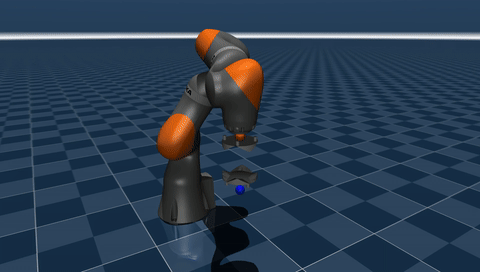
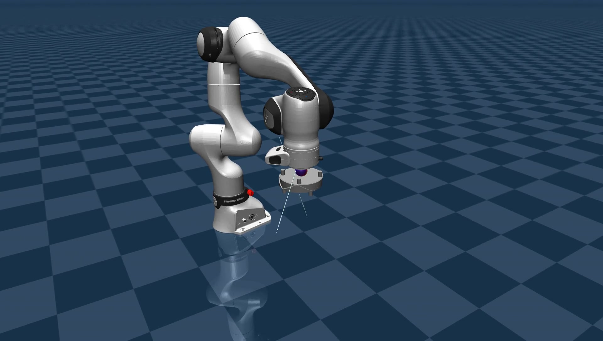
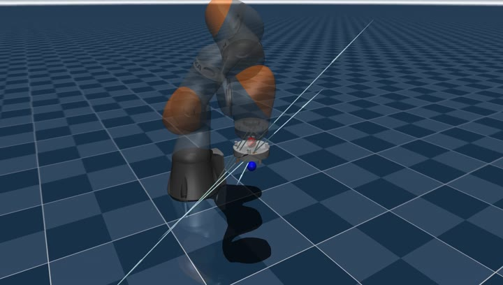
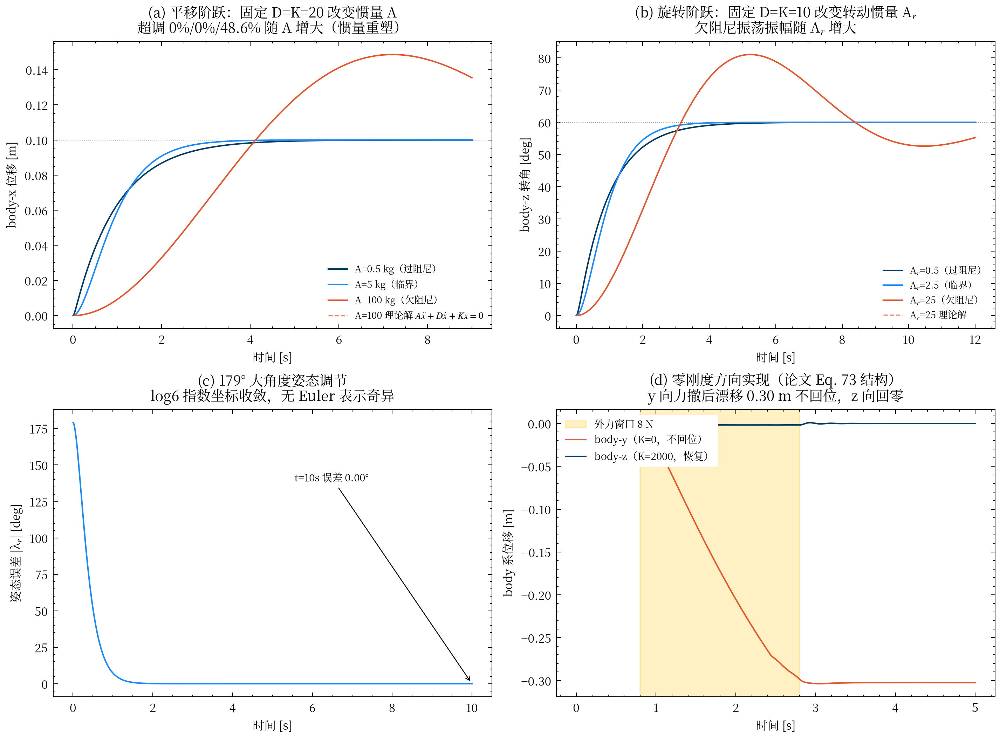

# Compliant Docking Simulation

[](https://github.com/langxin11/compliant_docking_simulation/actions/workflows/ci.yml)

[](LICENSE)

基于 MuJoCo / Pinocchio 的七自由度机械臂柔顺对接与装配仿真研究仓库。
MuJoCo 提供物理世界，Pinocchio 提供运动学与控制侧刚体动力学；内置 KUKA iiwa14 与 Franka FR3。
当前主线：固定模型与声明条件下，柔顺策略对对接完成、最终误差、完成时间和失败边界的影响，
以及完整装配集成。见[研究主线](docs/research_focus.md)与[研究范围](docs/research_scope.md)。

| 层次 | 回答的问题 | 入口与说明 |
|---|---|---|
| 模型与接口 | 研究对象、坐标、接触条件是否明确且一致？ | [模型基线](docs/models_interfaces.md)、`experiments/models_interfaces/` |
| 柔顺控制算法研究 | 固定接口下，绕轴或横向释放改变了什么？ | [RQ1/RQ2 协议](docs/control_research.md)、`experiments/control/` |
| 完整对接/装配 | 规划、控制、状态切换与交接能否完成任务？ | [系统验证](docs/system_validation.md)、`experiments/system/` |

单接口默认采用 `angle1_blend030` 凸块模型（物理/控制/反馈延迟均为 1 ms），
入口为 `scenes/iiwa14_petal_insertion.yaml`；HexFrame 正式场景仍用旧接口。

## 安装与冒烟

```bash
git clone https://github.com/langxin11/compliant_docking_simulation.git
cd compliant_docking_simulation
uv sync --frozen --dev        # 推荐 uv；标准环境可用 python -m pip install -e .
uv run docking --quick        # 2 s 链路检查，不代表完整验收
uv run pytest -m 'not slow' -q
```

无显示环境设 `MUJOCO_GL=egl`；Ubuntu 需要 `libegl1`、`libegl-dev`。

## 三类实验怎么跑

```bash
# 模型与接口：固定基线的双引擎、关节与初始接触检查
uv run python -m experiments.models_interfaces.baseline --out runs/model_baseline_my_run

# RQ1：固定接口，仅比较绕轴策略
OPENBLAS_NUM_THREADS=1 uv run python -m experiments.control.rq1_yaw \
  --case combined --setting baseline --out runs/rq1_my_run

# RQ2：固定绕轴释放，同点比较保持/释放 XY
OPENBLAS_NUM_THREADS=1 uv run python -m experiments.control.rq2_lateral \
  --stage paired --out runs/rq2_my_run --jobs 3

# 系统：完整 53 s HexFrame 装配 + 独立审计；同目录可回放生成视频
OPENBLAS_NUM_THREADS=1 MUJOCO_GL=egl uv run python -m experiments.system.hexframe \
  accept --out runs/hexframe_my_run
```

一个实验回答一个问题；每次运行使用 `runs/` 下的新目录。控制研究读各组 JSON 的
`assessment`（计算完成不等于对照组全通过）；系统验收要求 `validation.json` 与独立
`audit.json` 均通过，预检为 `INCOMPLETE`。完整命令、退出语义与历史研究入口见
[实验复现手册](docs/experiments.md)。

## 去哪里看结果

- `results/` —— 冻结的轻量结论摘要与支撑图表，按原协议解释，不续写旧结果。
- `docs/control_main_results.md` —— 当前控制主结果与失败边界。
- `docs/historical_evidence.md` —— 按问题分类的历史证据索引。
- 新运行数据一律写 `runs/`（Git 忽略）。

## 演示

| iiwa14 经典阻抗 | FR3 摩擦场景 | iiwa14 SE(3) Lie |
|---|---|---|
| [](demo/docking.mp4) | [](demo/fr3_docking.mp4) | [](demo/se3_lie_docking.mp4) |

SE(3) 自由空间验证覆盖惯量重塑、179° 姿态与零刚度方向：



## 目录与文档

```text
assets/                          模型资产、许可与来源记录（唯一来源）
scenes/                          声明物理与控制配置的场景
experiments/models_interfaces/   模型资格检查、接口候选与几何编排
experiments/control/             RQ1/RQ2、误差范围与自由空间验证
experiments/system/              HexFrame 正式验收、预检、回放与 P0/P1/P2 扩展
src/compliant_docking/           共享模型、控制、规划、仿真与系统实现
tests/                           数学、配置与行为回归
results/                         冻结的轻量研究证据
demo/                            精选展示图件与视频
runs/                            本地运行输出（Git 忽略）
```

深入阅读：[架构](docs/architecture.md) · [实验复现手册](docs/experiments.md) ·
[论文对照](docs/paper_mapping.md) · [SE(3) 理论](docs/theory/se3_lie_impedance.md) ·
[API](docs/api/control.md)。编码代理先读 [AGENTS.md](AGENTS.md)；
贡献与检查要求见[贡献指南](CONTRIBUTING.md)与[变更记录](CHANGELOG.md)。

## 许可与参考

项目代码使用 [MIT](LICENSE)，导入资产遵循各资产目录内的许可与来源清单。
控制方法参考 Kim et al. (2025, IEEE T-RO) 与 Ren & Shan (2026, Acta Astronautica)，
对应关系见[论文对照](docs/paper_mapping.md)。项目目前仅有仿真证据，未验证实机、
制造公差或真实锁紧。
