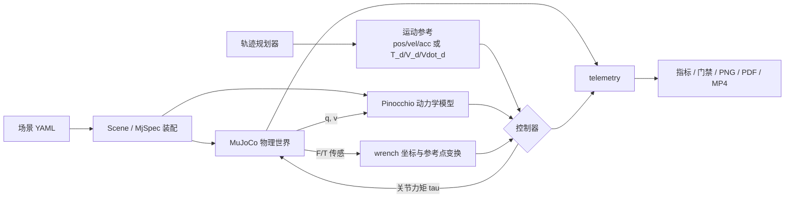

# Compliant Docking Simulation

[](https://github.com/langxin11/compliant_docking_simulation/actions/workflows/ci.yml)

[](LICENSE)

面向七自由度机械臂的柔顺对接研究与复现实验平台。项目以 **MuJoCo** 作为独立物理世界、以
**Pinocchio** 作为控制器侧动力学模型，在 1 kHz 闭环中统一比较经典任务空间阻抗、
SE(3) Lie 群阻抗和 HQP-AC，并提供轨迹规划、无传感器外力估计、跟踪门禁、指标统计与可复现图表。

当前内置 **KUKA iiwa14** 与 **Franka FR3** 两套机器人场景；模型、控制器和实验编排彼此解耦，
便于替换机械臂、对接接口或控制算法。

## 项目定位与实验边界（2026-10）

本项目的定位是：**固定基座、零重力研究条件下，机械臂柔顺对接/装配的仿真验证平台**。
它回答"给定接口几何与柔顺策略，接触式插入/装配能否按声明门禁通过"，不覆盖实机标定、
锁紧认证、轨道力学与自由漂浮基座。零重力是门禁有效域的一部分：基于轴向 F/T 的检测
阈值与锁定窗口（十分之几牛量级）在有重力时会被静载污染，推广到重力工况需先做静载/惯性
补偿核验并重新验收，作为独立后续工作（见 `docs/development_plan.md`）。据此只保留两类
**必要实验**：

| 主线 | 场景 | 状态 |
|---|---|---|
| HexFrame 正式组装 | `scenes/hexframe_assembly.yaml`（存储→抓取→转运→接触就位→卸力→撤离，CI 全程验收） | 活跃 |
| PetalDock100 候选导向轮廓 | `angle1_blend030`（1° / 0.3），复核入口 `experiments/petal_selected_study.py` | 候选已验证，未晋升定型 |

其余实验线均已**关闭**并保留结论：三控制器框架对比、冠形接口 SDF/凸碰撞/接触诊断
（结论：默认保留 SDF）、petal 固定刚度→绕轴释放→横向释放→捕获网格→导向几何各阶段
（结论见 `results/*.md`）。关闭阶段的原始逐步遥测已按数据策略精简，需要时按报告命令重跑。

数据策略：每次运行用带日期的 `--out`；结论以 JSON 门禁 + PNG/PDF 图 + 报告为准；
物理步长加密复跑（dt_half/dt_quarter）默认只保存核心遥测通道（`--telemetry` 可覆盖）。
`runs/README.md` 是本地数据索引。

## 演示

点击预览图可播放完整 MP4。视频均由仓库内场景和控制器直接生成。
新录制视频会叠加青色规划点列、绿色当前期望点、橙色实际末端采样点，以及接触阶段的浅青色力箭头。

| iiwa14 经典阻抗对接 | FR3 摩擦场景对接 | iiwa14 SE(3) Lie 对接 |
|---|---|---|
| [](demo/docking.mp4) | [](demo/fr3_docking.mp4) | [](demo/se3_lie_docking.mp4) |

SE(3) 自由空间实验复现了平移/旋转惯量重塑、179° 大角度姿态调节和零刚度方向：


## 核心能力

| 能力 | 实现 |
|---|---|
| 双引擎闭环 | MuJoCo 负责接触、传感与积分；Pinocchio 负责 `M/C/J/Jdot`、IK 与逆动力学 |
| 三类控制器 | `impedance`、`se3_lie`、`hqp` 通过同一 CLI 切换 |
| SE(3) 运动参考 | 位姿 `T_d`、body twist `V_d` 和 `Vdot_d` 按步传递；兼容 SE(3)-TOPP 与纯位置轨迹 |
| 规划器 | 单段/两段五次、圆与 8 字跟踪、SE(3) 测地线与解析时间最优剖面 |
| 接触与外力 | 六维 F/T 传感、body/world wrench 变换、PI 动量观测器、接触预紧 |
| 工程化验收 | 自由空间 PASS/FAIL 门禁、接触安全/内部安全/跟踪精度三层指标、确定性回归测试 |
| 可复现输出 | IEEE 风格 PNG/PDF、MP4 录制、框架对比表和完整 MkDocs 文档 |

## 快速开始

推荐使用 [uv](https://docs.astral.sh/uv/)：

```bash
git clone https://github.com/langxin11/compliant_docking_simulation.git
cd compliant_docking_simulation
uv sync --dev

# 2 s 链路冒烟；不作为性能验收
uv run docking --quick

# 完整默认对接实验（iiwa14 + 经典阻抗）
uv run docking
```

没有 uv 时可使用标准虚拟环境；项目依赖由 `pyproject.toml` 统一维护：

```bash
python -m venv .venv
source .venv/bin/activate
python -m pip install -e .
docking --quick
```

无显示环境建议启用 EGL：

```bash
MUJOCO_GL=egl uv run docking --scene scenes/fr3_docking.yaml
```

系统需提供 EGL 运行库；Ubuntu 可安装 `libegl1` 与 `libegl-dev`。

## HexFrame 完整组装

新增正式场景覆盖存储锁定、机械臂抓取确认、竖直提起、转运、导向/止挡接触、持续就位、卸力释放与撤离。原默认 iiwa14 场景保留。

```bash
OPENBLAS_NUM_THREADS=1 MUJOCO_GL=egl uv run docking \
  --scene scenes/hexframe_assembly.yaml --record --out runs/hexframe_my_run
```

完整流程为 53 秒，自动核对六侧面端口、CAD 质量惯量、可达性、交接保护和独立接触审计。每次使用新结果目录，保留实验入口与历史数据。这是固定基座零重力实验，理想 weld 锁定与预锁定基座连接尚未包含锁销和预紧机构；不能作为自由漂浮航天器验证。[运行、架构和物理边界](docs/hexframe_assembly.md)。

## 选择控制器

```bash
# 经典固定增益任务空间阻抗（默认）
uv run docking --controller impedance

# Kim et al. 2025 §III-A：SE(3) Lie 群阻抗
uv run docking --controller se3_lie

# Ren & Shan 2026 §3.2：带硬约束与自适应刚度的 HQP-AC
uv run docking --controller hqp
```

| CLI 名称 | 核心特征 | 坐标系与约束 |
|---|---|---|
| `impedance` | 位置/姿态双通道阻抗、接触力前馈、动力学一致零空间阻尼 | `LOCAL_WORLD_ALIGNED`；运行期软限幅 |
| `se3_lie` | `T~ = T^-1 T_d`、`log6`、完整 `dexp`/时间导数、六维 A/D/K 惯量重塑 | body Jacobian + body wrench；7-DoF 动力学一致广义逆 |
| `hqp` | 自适应刚度、奇异性规避、关节位姿任务、传感器/观测器外力切换 | 关节位置、速度和力矩 QP 硬约束 |

`se3_lie` 实现的是论文的标称控制器，**不包含** Kim et al. §III-B 的 NRIC 鲁棒内环。
数学约定、有限差分 oracle 和已知边界见
[SE(3) Lie 群阻抗控制器文档](docs/theory/se3_lie_impedance.md)。

## 推荐验收流程

新增的组合场景覆盖**侧方接近 → 目标上方路点 → 低速下降 → 带 XY/yaw
估计误差的柔顺插入**，保留公头原有安装相位，重点比较绕插入轴的刚度。
六组小实验合并到一个场景和一个入口，统一输出进给、接触后转角、力与力矩：

```bash
uv run docking --scene scenes/iiwa14_compliant_insertion.yaml
MUJOCO_GL=egl uv run python experiments/insertion_suite.py --preview
```

组合场景默认采用 `se3_lie`，时长自动覆盖轨迹和保持。其 PASS 表示声明的进给与
稳定门禁通过，尚不等于 CAD 完全就位或锁紧。场景定义、实验合并方案与后续顺序见
[完善方案与组合对接](docs/development_plan.md)。

几何参考与真实接触载荷诊断复用同一实验入口：
`experiments/insertion_suite.py --diagnose --sensitivity --out runs/contact_diagnostics_20261002`。
原 F/T 门禁与新的综合验收分别报告；可用 `--reanalyze --sensitivity` 从已保存数据重建
诊断图与门禁。当前原基线虽有 3 组 PASS，真实接触轴矩验收仍未通过。

先运行自由空间门禁，再运行接触对接：

```bash
# 完整覆盖圆形和 8 字轨迹；PASS=0，FAIL=2
uv run --frozen docking --scene scenes/iiwa14_tracking.yaml --duration 13.1
uv run --frozen docking --scene scenes/fr3_tracking.yaml --duration 13.1

# 对接场景
uv run --frozen docking --scene scenes/iiwa14_docking.yaml
uv run --frozen docking --scene scenes/fr3_docking.yaml
```

默认 1 ms 步长下，自由空间位置 RMS 基线为：iiwa14 圆/8 字约
`0.236/0.269 mm`，FR3 约 `1.545/0.938 mm`；两者均无接触和力矩饱和。
这些数值只验收自由空间跟踪链路，不等同于最终对接精度。

SE(3) Lie 控制器的独立动力学渲染实验：

```bash
# 五组 PASS/FAIL 实验；--quick 可做短时检查
uv run python experiments/se3_free_space.py

# 重跑核心实验并生成 figure/se3_free_space/ 下的 PNG/PDF
uv run python experiments/se3_free_space_plots.py
```

框架对比研究：

```bash
MUJOCO_GL=egl uv run python experiments/compare_frameworks.py
MUJOCO_GL=egl uv run python experiments/compare_frameworks.py \
  --scene scenes/fr3_docking.yaml
```

结果写入 `results/framework_comparison_*.md`，图件写入 `figure/framework_comparison/`。
完整命令、阈值和基线见[实验复现手册](docs/experiments.md)。

## 架构


```mermaid
flowchart LR
    YAML[场景 YAML] --> SCENE[Scene / MjSpec 装配]
    SCENE --> MJ[MuJoCo 物理世界]
    SCENE --> PIN[Pinocchio 动力学模型]
    PLAN[轨迹规划器] --> REF[运动参考<br/>pos/vel/acc 或 T_d/V_d/Vdot_d]
    REF --> CTRL{控制器}
    PIN --> CTRL
    CTRL -->|关节力矩 tau| MJ
    MJ -->|q, v| PIN
    MJ -->|F/T 传感| W[wrench 坐标与参考点变换]
    W --> CTRL
    MJ --> LOG[telemetry]
    CTRL --> LOG
    LOG --> OUT[指标 / 门禁 / PNG / PDF / MP4]
```

关键边界是：控制器不读取 MuJoCo 的内部动力学量。MuJoCo 只接收关节力矩并返回状态与传感器
数据，Pinocchio 独立计算控制所需模型量。这与真实机器人上“物理本体 + 模型基控制器”的部署
结构一致。`simulation/consistency.py` 通过质量矩阵和前向动力学交叉验证保证两套模型同源。

## 场景与配置

场景文件位于 `scenes/`，一份 YAML 描述机器人、工具、目标、物理参数、任务初值和可选控制器
覆盖参数。运行时通过 MuJoCo `MjSpec.attach` 装配机械臂、公头和母头，无需维护重复的整机 XML。

```bash
uv run docking --scene scenes/iiwa14_docking.yaml --controller se3_lie
uv run docking --scene scenes/fr3_docking.yaml --controller hqp
uv run docking --scene scenes/fr3_docking_sensorless.yaml --controller hqp
```

- **iiwa14**：MuJoCo 使用机械臂 MJCF，Pinocchio 使用臂与工具组合 URDF；零摩擦，承担确定性锚点。
- **FR3**：两侧均从 MJCF 构建，保留真实减速器摩擦；用于摩擦前馈、观测器和接触预紧实验。
- `friction_comp: torque|velocity` 控制摩擦前馈方向语义。
- `se3_impedance:` 可覆盖六维 `A/D/K` 对角参数和零空间阻尼。
- `hqp:` 可配置外力来源、观测器增益、死区与预紧力。
- `trajectory.type` 支持 `twophase`、`se3topp` 和 `tracking`；省略该段使用历史单段五次轨迹。

SE(3)-TOPP 已能按步输出完整位姿和 body 运动参考，并已接入 `se3_lie` 控制链路。传统内置对接
场景仍使用 `final_ori = init_ori`。新增组合场景在接近阶段过渡到估计姿态，接触阶段保持参考
姿态并观察被动绕轴转动；持续改变接触阶段期望姿态的旋转插入仍待验证。

## 仓库结构

```text
├── assets/                         # iiwa14、FR3 与公头/母头模型资产
├── scenes/                         # 对接、跟踪、无传感器场景 YAML
├── src/compliant_docking/
│   ├── control/                    # CIC、SE(3) Lie、HQP-AC、摩擦与动量观测器
│   ├── planning/                   # 五次/跟踪轨迹、SE(3)-TOPP、运动参考适配、IK
│   ├── simulation/                 # MuJoCo、Pinocchio RK4 与双引擎一致性验证
│   ├── scene.py                    # 场景解析与 MjSpec 装配
│   ├── wrench.py                   # wrench 坐标系与参考点变换
│   ├── metrics.py                  # 对接指标与自由空间门禁
│   ├── plotting.py                 # 统一 IEEE 绘图样式
│   └── telemetry.py                # 时序与 SE(3) 诊断记录
├── experiments/
│   ├── run_docking.py              # 主仿真编排
│   ├── compare_frameworks.py       # 2x2 框架对比
│   ├── se3_free_space.py           # SE(3) 自由空间验收
│   └── se3_free_space_plots.py     # SE(3) 验证图生成
├── tests/                          # 数学 oracle、集成、门禁和慢速接触回归
├── docs/                           # MkDocs 文档源文件
├── demo/                           # README 使用的受版本控制媒体
└── results/                        # 已提交的框架对比结果表
```

## 测试与开发

```bash
# CI 同款：静态检查 + 非慢速测试
uv run ruff check .
uv run pytest -m "not slow" -q

# 12 s 接触回归；用于锁定误差和接触力数值锚点
uv run pytest -m slow -q

# 文档严格构建
uv run mkdocs build --strict
```

数值稳定性相关实现不只依赖期望值测试：Lie 群工具包含有限差分、矩阵恒等式、Adjoint 共轭、
功率守恒和近 π/小角度分支测试；wrench 变换验证力矩平移与虚功率不变性。

## 文档

- [架构总览](docs/architecture.md)
- [实验复现手册](docs/experiments.md)
- [论文—代码对照](docs/paper_mapping.md)
- [阻抗控制基础](docs/theory/impedance_control.md)
- [SE(3) Lie 群阻抗控制器](docs/theory/se3_lie_impedance.md)
- [主仿真理论与数据流](docs/theory/simulation_flow.md)
- [控制器 API](docs/api/control.md) · [规划器 API](docs/api/planning.md) · [核心模块 API](docs/api/core.md)

本地预览：

```bash
uv run mkdocs serve
```

## 研究边界

- 目前是仿真研究平台，不包含 ROS 2 驱动，也未在真实机器人上验证。
- `se3_lie` 未实现 Kim et al. 2025 §III-B 的 NRIC 鲁棒内环。
- `log6` 使用主对数分支；大角度测试覆盖 179°，不声称跨越 SE(3) 对数映射的单射半径。
- 生成的 `figure/`、`video/` 和 `runs/` 默认不纳入版本控制；README 媒体是从可复现实验中挑选的快照。

## 参考工作

- J. Kim et al., “Impedance Control Design Framework Using Commutative Map Between SE(3) and se(3),” *IEEE Transactions on Robotics*, 2025.
- Ren & Shan, unified compliant control and trajectory-planning framework, *Acta Astronautica*, 2026.

## License

[MIT](LICENSE)

### 可选凸碰撞接口

`experiments/insertion_suite.py --collision convex --diagnose --sensitivity` 使用已生成并
通过采样几何验收的凸块，保留原视觉网格、安装角和惯量。完整动力学验收尚未通过，
默认仍使用 SDF。生成工具为可选 `geometry` 依赖组，运行时不需要 CoACD。

[凸碰撞几何与完整对照结果](results/convex_collision_iiwa14.md)。

### PetalDock100 替代接口验证

新接口场景为 `scenes/iiwa14_petal_insertion.yaml`，复用现有规划、SE(3) 阻抗和
机械臂仿真循环。接口已经提供凸碰撞分块；安装根位于法兰，名义配合为
`Rz(45°) Rx(180°)`，法兰间距 46.4 mm。几何门禁同时要求承载的止挡接触。

```bash
# 组合误差：固定高/低绕轴刚度与接触后释放，含物理半步长对照
OPENBLAS_NUM_THREADS=1 MUJOCO_GL=egl uv run python experiments/petal_insertion_suite.py \
  --case combined --profile stiff compliant released --setting baseline dt_half \
  --jobs 2 --preview --out runs/petal_contact_control_reproduction --resume

# 释放策略：补充无误差与仅 XY 误差的完整流程
OPENBLAS_NUM_THREADS=1 MUJOCO_GL=egl uv run python experiments/petal_insertion_suite.py \
  --case nominal xy --profile released --jobs 2 \
  --out runs/petal_contact_control_reproduction --resume
```

该场景的 `robot.pin_model: null` 表示 Pinocchio 和 MuJoCo 读取同一份展开后的
组装 MJCF，避免重复计入工具或沿用旧工具惯量。关节范围、求解器容差和迭代数
均在场景中声明。每步记录接触合力、绕轴力矩、止挡接触数和 F/T 惯性平衡；
控制周期和 F/T 延迟固定为 0.5 ms，`dt_half` 仅细分物理步长；传感器样本保存
求解时刻的世界位姿，反馈前搬移到当前 body 原点与坐标轴。`released` 在插入阶段
由轴向 F/T 载荷触发，0.25 s 内将绕轴刚度从 0.5 降为零，阻尼与倾斜约束保留。
单独启动场景时使用 `docking --scene scenes/iiwa14_petal_insertion.yaml --dt 0.0005`。

报告位于 `runs/petal_contact_control_20261002_v2/report.md`。该入口的试验结论以
JSON 中的 `assessment` 为准，脚本正常结束不表示所有对照组通过。

导入脚本 `experiments/prepare_petal_interface.py <解压后的模型目录>` 只读取模型
XML 和网格，生成适配片段与新的内容哈希清单，不执行附件内脚本。

此前绕轴释放策略的 4 组完整流程均达到落座候选条件，包括 XY + 5° 偏航及其
半步长复核；同一组合误差下固定高/低刚度仍未落座。控制周期固定后，三种策略
都通过两个物理步长的原比较阈值。矩阵复用 4 组配置一致的固定刚度对照，保留来源校验。
[接触释放与反馈验证](results/petal_contact_control_validation.md)；
[首轮固定刚度记录](results/petal_iiwa14_validation.md)。

### XY／偏航误差离散扫描

同一实验入口的 `--grid` 模式复用原控制循环和全部验收条件：

```bash
OPENBLAS_NUM_THREADS=1 OMP_NUM_THREADS=1 MUJOCO_GL=egl uv run python experiments/petal_insertion_suite.py \
  --grid --xy-mm -6 0 6 --yaw-deg -15 0 15 --jobs 3 \
  --refine 4 --boundary-checks 4 \
  --out runs/petal_capture_grid_reproduction --resume
```

27 个粗网格点分别验证正负误差，允许复用有效配置完全一致的既有运行。通过/失败相邻点之间最多补充 4 个中点，
再选最多 4 个代表点做物理半步长复核；控制周期与反馈延迟始终保持 0.5 ms。
若粗网格全通过，会检查 4 个更大误差探针，不将扫描域边缘当作真实捕获边界。
`capture_grid.png` 的色块仅表示采样点，不能解释为连续区域。

网格参数、源码、模型哈希及自适应补点/复核清单在运行时固定；续跑不会重新增加
补点预算。`--reuse-from` 要求有效配置相同，且控制/物理源码和验收逻辑未变；
原始数据哈希保存在每组 JSON 中。查看输出目录中的 `report.md` 和
`boundary_numerics.json`，脚本退出成功不表示所有采样点都通过。

上一轮仅绕轴释放的粗网格 3/27 点通过：XY 误差为零，偏航分别为 −15°、0°、+15°。
零偏航下，单轴 ±3 mm 的四个细化点均通过，单轴 ±6 mm 的四个点均未持续
承载止挡。已验证的 (2, −2) mm + 5° 组合点仍保留；不能把单轴结果推广为
整个 XY 方形或任意偏航组合。边界步长复核、失败机制及全部数据见
[误差网格验证与下一步](results/petal_capture_grid_validation.md)。

40 份记录已通过独立数据审计。四个半步长复核点的落座判定不变，但三处载荷
峰值敏感，已追加 0.125 ms 验证；最新相邻比较仍有两处敏感，原步长与最小步长
比较三处均敏感。当前不能宣称载荷全面稳定或连续捕获范围已经得到证明。

### 接触后的 XY 与绕轴释放

此前在原 F/T 触发、滤波和保持检测上增加可选
`se3_impedance.contact_yaw.lateral_stiffness_after`，使用同一个 0.25 s 平滑释放过程。
设为 `0.0` 时，接触后的 XY 刚度从 80 N/m 降到零，同时保留轴向预紧、倾斜约束、
惯量和阻尼；省略该字段保持原来的固定 XY 刚度。

```bash
# 九个误差点的原/新策略配对，以及固定控制周期下的物理步长复核
OPENBLAS_NUM_THREADS=1 OMP_NUM_THREADS=1 MUJOCO_GL=egl uv run python experiments/petal_insertion_suite.py \
  --lateral-study --jobs 3 --out runs/petal_lateral_reproduction --resume

# 与已验证的单轴 -6 mm 半步长组配置一致的完整演示
MUJOCO_GL=egl uv run docking --scene scenes/iiwa14_petal_lateral_insertion.yaml --dt 0.00025
```

九个配对点中，原策略 3/9、新策略 7/9 达到落座候选。四个单轴 ±6 mm 点现在持续承载
止挡，原先成功的无误差、小组合误差和纯 −15° 偏航点仍通过。两个较大 XY＋偏航组合
仍停在落座高度上方约 16.3 mm；没有验证连续捕获范围或锁紧。−6 mm 点的
0.5/0.25 ms 比较符合原几何与载荷阈值，其他代表点的加密结果和剩余敏感性见
[横向释放验证](results/petal_lateral_control_validation.md)。

全部 23 次完整仿真通过独立数据审计，248 项非慢速软件测试通过。三个代表点的
最新相邻步长比较均符合原阈值；组合与偏航点的粗步长和最小步长直接比较仍敏感，
因此不宣称峰值全面收敛。其他单轴方向尚未做本轮独立步长复核。

该控制对照矩阵全部重新运行。旧输出按原源码快照保留；新字段改变源码指纹，因此不能直接
将旧数据传给当前 `--reuse-from`。`--lateral-study` 固定源码、有效配置及加密预算，
续跑时拒绝混入不同实现。其余入口的默认输出使用 `*_current`，复现仍建议明确指定新目录。

### 可选导向几何对照

`--geometry-study` 在同一规划、SE(3) 阻抗和接触释放循环中比较原 PetalDock100、
窄平顶加角向斜坡、角向斜坡加径向导面。候选位于
`assets/interfaces/petal_guidance/narrow` 和 `radial`，原接口保留。

```bash
OPENBLAS_NUM_THREADS=1 OMP_NUM_THREADS=1 MUJOCO_GL=egl uv run python experiments/petal_insertion_suite.py \
  --geometry-study --jobs 3 --out runs/petal_guidance_reproduction --resume
```

三个模型都保留 100 mm 外径、18 mm 导向高度、原安装头、止挡和 46.4 mm 落座基准。
角向候选同时收窄平顶和改变工作斜坡；径向候选在此基础上增加互补导面，不能将它们
视作单一参数消融。碰撞块、质心和完整惯量一起更新；生成器无需额外 CAD/凸分解依赖。
这些是仿真原型，尚未生成制造 STEP。参数和资产说明见
[导向模型说明](assets/interfaces/petal_guidance/README.md)。

矩阵包含 27 次新的主对照（物理步长 0.25 ms），再按固定预算追加 4 次
0.125 ms 检查；控制周期/反馈延迟均保持 0.5 ms，摩擦、速度和验收门槛不变。
通过代表声明工况下的仿真落座候选，不能据此证明连续捕获范围或锁紧。

可选场景 `iiwa14_petal_guided_insertion.yaml` 使用角向候选，复现横向 −6 mm、
偏航 +15° 的主矩阵工况；有效参数与对应记录一致：

```bash
MUJOCO_GL=egl uv run docking --scene scenes/iiwa14_petal_guided_insertion.yaml --dt 0.00025
```

本轮主对照：原轮廓 **7/9**、角向候选 **9/9**、径向候选 **6/9** 达到落座候选。
角向候选解决两个 ±6 mm / ±15° 组合卡滞，所有已测工况的峰值接触合力低于 18.2 N。
径向候选在三个含 15° 偏航的工况中出现载荷超限，最大约 244 N，暂不采用。
四组 0.25/0.125 ms 比较均符合原差异门槛，但不能据此证明完整数值收敛。

全部 31 次仿真通过数据审计，256 项非慢速软件测试通过。模型、源码、原始记录、
图表和复现场景按哈希归档；原接口及前轮输出保留。
[导向几何完整验证](results/petal_guidance_geometry_validation.md)。
