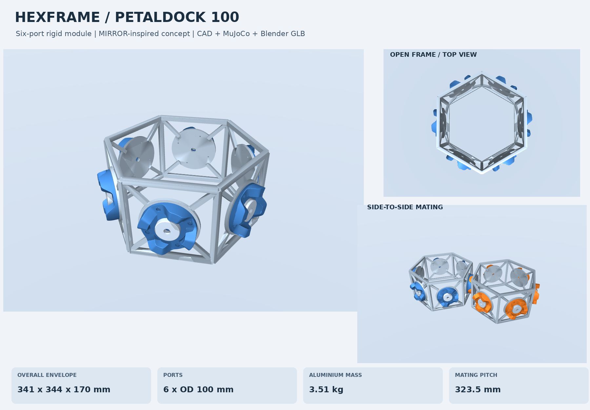

# HexFrame：带六个花瓣接口的空间装配模块

这是参考 MIRROR“结构模块＋标准接口＋机器人装配”思路建立的原创六棱柱框架，用于几何布局和 MuJoCo 刚体对接研究。它不是 MIRROR 原厂 CAD，也不声明与 HOTDOCK 产品互换。框架通过六个安装座连接 PetalDock100 V2 对接头，机器人侧可继续使用之前的 iiwa 14 转接板。



## 1. 本版尺寸与构成

| 项目 | 数值 / 定义 |
|---|---|
| 六边形顶点半径 | 160 mm，指梁中心线顶点 |
| 上下框中心线间距 | 160 mm |
| 主框梁截面 | 10 × 10 mm，实心截面 |
| 接口支撑杆截面 | 8 × 8 mm，实心截面 |
| 完整模块外包络 | 约 341.13 × 343.50 × 170.00 mm，包含花瓣突出部分 |
| 接口安装板 | Ø110 mm，厚 6 mm，中心孔 Ø12 mm |
| 对接头安装孔 | PCD82 上的 4 个 Ø3.3 mm M4 名义攻丝底孔；螺纹未实体化 |
| 花瓣接口 | 6 × Ø100 mm，使用前一版 V2 的平滑导向几何 |
| 名义相邻模块中心距 | 323.528 mm |
| 完整模块质量 | 约 3.508 kg，按 2700 kg/m³ 铝材估算 |
| CAD 装配体 | 一个连通的框架/安装座实体＋六个独立对接头 |

质量来自 CAD 体积和惯量，框架与支撑杆的相交部分先布尔合并，避免重复计重。没有包含紧固件、锁紧机构、电子设备及线缆。框架各杆件的螺栓或焊接节点尚未细化；当前 STEP 框架实体用于表达几何和载荷通路，不是已完成工艺设计的加工图。

## 2. 直接运行 MuJoCo

Python 3.12 环境示例：

```bash
uv venv --python 3.12
source .venv/bin/activate
uv pip install -r requirements.txt
python demo.py
```

Windows PowerShell 使用 `.\.venv\Scripts\Activate.ps1` 激活环境。也可用普通 Python 的 venv 和 pip。

查看单个模块：

```bash
python -m mujoco.viewer --mjcf=mjcf/single.xml
```

运行默认双模块对接，或只进行计算：

```bash
python demo.py
python demo.py --headless
```

关闭锁定及横向、姿态定位刚度，观察导向面的作用：

```bash
python demo.py --headless --guide-only --no-lock --output results/guide_only
```

查看三个模块的闭环布局：

```bash
python -m mujoco.viewer --mjcf=mjcf/three_modules.xml
```

三模块文件仅用于名义布局检查，没有验证三模块的装配顺序或多接口同时插入过程，也没有启用模块间锁紧约束。

## 3. 端口坐标与安装角度

模块原点位于框架中心，Z 轴沿六棱柱轴线。端口 0—5 的外法向分别位于 XY 平面的 0°、60°、120°、180°、240°、300°。

先以“水平切向、模块 +Z、面外法向”定义每个面的局部 X、Y、Z 轴，再将接口绕局部 Z 轴转 67.5°。这样，两个上下方向一致的模块，端口 0 和端口 3 相向时，其花瓣接口恰好满足 `Rz(45°) Rx(180°)` 的相对姿态；不需要把整个模块倾斜 45°。

- `a_port0_mount_site` 等：沿用接口原点定义的安装参考系。此参考面为局部 z=0，并非安装板顶面。
- 安装板在接口局部 z=2—8 mm，对接头底板从 z=8 mm 开始。
- `a_port0_mating_site` 等：接口局部 z=23.2 mm。
- 名义对接时，两侧 mating site 的位置重合，但坐标轴不重合，须满足规定的相对旋转。
- 所有端口位置、姿态、法向及模块质量/惯量写在 `model_info.json`。

生成器由端口坐标系组合出双模块的名义相对位姿。修改 `port_clocking_deg` 后，双模块名义姿态随之改变；三模块平面布局只在默认 67.5°、六个端口启用时生成。

## 4. CAD 和参数化修改

修改 `config.json` 后运行：

```bash
uv pip install -r requirements-cad.txt
python generate.py
python validate_model.py
python demo.py --headless
```

关键参数：`frame_vertex_radius_mm`、`frame_ring_separation_mm`、`beam_width_mm`、`brace_width_mm`、`enabled_ports`、`port_clocking_deg`。禁用某个对接头时，对应安装座和支撑杆仍保留。

当前安装板按 Ø100 mm 对接头、PCD82 的 M4 孔型设计，不支持只修改接口直径而不联动修改安装结构。`interface/source/generate.py` 保留了接口自身的参数化生成代码；如需重建接口，可执行：

```bash
python interface/source/generate.py --config interface/config.json --output interface
python generate.py
```

CAD、MJCF 和 GLB 的单位转换已处理。STEP/STL 为 mm；OBJ/MJCF/GLB 为 m。将毫米 STL 自行放入 MuJoCo 时需要设置相应缩放。

## 5. Blender 使用方式

在 Blender 中通过 `File > Import > glTF 2.0` 导入 `blender/module.glb`。文件包含框架和各对接头网格、颜色及装配位置。GLB 使用标准 Y-up 坐标，Blender 导入后会转换回其 Z-up 场景；长度单位为米。

也提供 `blender/build_scene.py`，用于创建双模块场景、灯光和摄像机，并从 `results/demo/trajectory.json` 回放 MuJoCo 记录的真实位姿：

```bash
blender --background --python blender/build_scene.py
```

脚本会创建新场景并输出 `blender/hexframe_module.blend`。请在新文件或后台进程运行，避免清空正在编辑的 Blender 场景。该脚本不会重新计算对接物理。

本次已完成 GLB 的导出、重新读取与尺寸/坐标核对；当前生成环境没有 Blender，因此没有实际执行该导入脚本，也未附原生 `.blend` 文件。预览图和 GIF 由 MuJoCo 渲染。

## 6. 碰撞与物理模型

每个完整模块是一个刚体。框架碰撞由独立盒形梁、安装板凸代理构成，保留中间开口；没有把整个框架当作一个实心凸包。每个精细接口使用 416 个导向凸体＋24 个止挡凸体，以及独立底板代理。

默认六个端口全部启用精细碰撞。若只研究指定端口，可调整 `detailed_collision_ports`，其他启用的端口将使用完整包络粗代理。粗代理保留障碍物体积，不能用于花瓣插入研究。双模块演示要求端口 0、3 均开启精细碰撞。

小螺钉孔及安装板中心孔在其碰撞代理中省略；视觉/CAD 保留真实孔。碰撞代理和可视网格均不参与自动质量估算，刚体惯量由 CAD 单独计算。

默认演示参数：零重力，时间步长 0.5 ms，摩擦系数 0.15；轴向参考速度 10 mm/s，轴向刚度 1500 N/m，最大推进力 12 N。默认初始横向偏差为 2 mm、-1 mm，绕接近轴偏转 2°，倾斜 1°。接触前仅轴向推进与阻尼；接触后默认启用弱横向和姿态定位控制。初始化后不改写 qpos 驱动物体。

锁紧是抽象 weld。只有指定端口的止挡面实际接触，并满足位置、姿态和速度阈值持续 0.1 s 才启用。锁紧后的小误差属于约束求解结果，不能证明真实定位精度或连接刚度。

## 7. 随附验证

- MuJoCo 3.14.0 默认工况在约 4.29 s 触发锁紧，运行 9 s 无警告。
- 无锁紧、无横向/姿态定位刚度的同初始偏差工况完成落座，终态横向残差约 0.059 mm、角度残差约 0.085°；仅说明这一工况可运行。
- MuJoCo 3.1.6 的默认运行记录在 `results/compatibility_3_1_6/`。
- 名义接口位置、相对姿态、分离无接触、0.1 mm 过插碰撞以及模块中心空腔的射线检查均通过。
- CAD 检查确认框架是一个连通实体，框架与端口 0 对接头的实体相交体积为零；其余端口按六重旋转对称布置。
- 三模块布局的三个连接对均满足位置和旋转要求，名义状态没有碰撞穿透。
- GLB 重新读取并恢复工程坐标后，与生成时包络的差异小于 10⁻⁶ m。

模型没有柔性梁、接口弹性、真实锁紧机构或完整机械臂/轨道动力学。它是研究原型，尚未进行强度、模态、疲劳、制造公差及实物捕获范围校核。

## 8. 文件索引

| 文件 | 用途 |
|---|---|
| `cad/module_assembly_mm.step` | 模块装配体 |
| `cad/frame_with_mounts_mm.step` | 框架及安装座连通实体 |
| `cad/mount_plate_mm.step` | 单个安装板 |
| `interface/cad/docking_head_mm.step` | 可复用的花瓣对接头 |
| `blender/module.glb` | Blender 等软件可导入的装配网格 |
| `blender/build_scene.py` | Blender 场景与仿真位姿回放脚本 |
| `mjcf/single.xml` | 单模块 |
| `mjcf/pair.xml` | 双模块接触演示模型 |
| `mjcf/three_modules.xml` | 三模块闭环布局 |
| `demo.py` | 双模块接触推进、落座和抽象锁紧 |
| `generate.py`、`config.json` | 参数化结构生成器与配置 |
| `results/` | 验证 JSON、时序 CSV、位姿记录 |
| `preview/module_docking.gif` | 默认工况的 MuJoCo 位姿回放 |

预览可通过 `uv pip install -r requirements-preview.txt`、`python create_preview.py` 重建。重新生成模型后，需要重新运行演示和预览；旧的结果文件不会自动代表新配置。

## 9. 参考

- [MIRROR 设计与集成论文](https://elib.dlr.de/189349/1/Deremetz_iac22.pdf)：模块＋标准接口＋机械臂装配的架构参考。
- [MuJoCo 建模文档](https://mujoco.readthedocs.io/en/stable/modeling.html)：刚体、几何和接触模型。
- [CadQuery 文档](https://cadquery.readthedocs.io/en/stable/)：参数化 CAD 与 STEP 导出。

代码与原创模型采用 MIT 许可。包内没有复制 MIRROR 或 HOTDOCK 的原厂 CAD。
