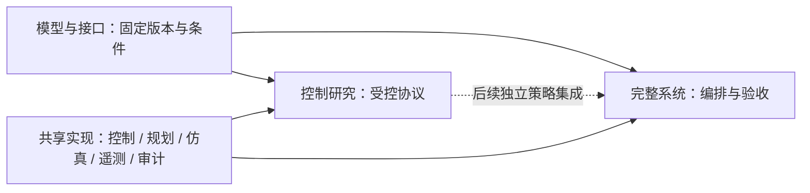

# 研究范围与三层职责

本项目按**研究对象与物理基线 → 对接方法与接触柔顺 → 完整装配与系统验证**三层组织。
**三层结构不是项目最初的开发顺序，而是当前为了建立清晰证据边界而采用的研究组织
方式**——项目实际怎样一步步发展，见[项目演化](project_evolution.md)。绘图、遥测、
坐标变换与审计为共享支撑。

| 层次 | 核心问题 | 允许独立变化的因素 | 交付 |
|---|---|---|---|
| 模型与接口（物理基线） | 我们到底在对接什么：模型、接口与接触条件是否明确且一致？ | 接口轮廓、碰撞表示、模型离散与资格检查条件 | 资产版本、质量惯量、配合定义、物理条件和检查记录 |
| 对接方法与接触柔顺 | 我们怎样控制机器人完成对接？ | 方法库与论文复现对照；预声明的绕轴/横向策略；独立误差范围与数值复核 | 协议、同点矩阵、有效配置、评价与失败边界 |
| 完整系统（集成验证） | 单接口上观察到的控制机制，进入完整装配流程后是否仍然成立？ | 独立系统扰动、测量/判定策略 | 全流程验收、状态事件、交接审计与同源回放 |

三层各自的定位：

- **模型与接口层是 research prerequisite（研究前提）**。资格检查证明"研究对象明确、
  双引擎一致、条件已声明"，不用于证明任何控制器的优越性，也不强行产生研究问题。
- **对接方法与接触柔顺层包含方法库与机制研究两部分**。方法库对应两篇主要参考文献
  的问题：Ren & Shan——在轨机器人进行模块对接时，怎样把轨迹规划和柔顺控制统一起来，
  使整个接触装配过程既能完成，又满足安全约束（复现于 SE(3)-TOPP + HQP-AC，见
  [论文对照](paper_mapping.md)）；Kim et al.——机器人末端位姿本来位于非欧氏的
  SE(3) 空间中，怎样才能用最小参数、保持正确几何结构，并且系统地设计一个真正的
  六自由度阻抗控制器（复现于 `se3_lie` §III-A）。当前收束的机制研究
  （mechanism study）在其上追问：接触以后各自由度的柔顺应怎样按接口几何分配——
  固定模型与接口，只改变预声明的控制变量（绕轴 / 横向策略），在同点配对中建立
  因果关系的证据；主线定义见[研究主线](research_focus.md)，机制表述见
  [选择性柔顺](theory/selective_compliance.md)。方法库与复现验证不等于当前研究主结果。
- **完整系统层是 integration validation（集成验证）**。不负责重新优化算法，只验证
  已有控制方法进入完整抓取—转运—对接—锁定任务后是否仍可工作；现有 HexFrame 使用
  独立关节伺服与接触导纳，研究策略的接入是后续工作。

当前优先研究对接完成、最终误差、效率与失败边界。接触载荷作为辅助观测，
精确峰值与模型精细化不作为普遍前置条件；具体停止条件见[研究主线](research_focus.md)。

## 初始有效域

固定基座、固定目标、零重力、刚性机械臂与接口。质量惯量、安装变换、关节限制已给定，
仿真用途的一致性检查不能代替实物标定。每组主控制对照固定接口、碰撞、摩擦、接触求解、
轨迹、采样和评价设置。主研究先覆盖 XY 与绕轴偏航估计误差；倾斜、重力、浮动基座分别扩展。

规划与控制使用声明的估计目标及反馈；目标真值、接触标签和止挡状态仅用于评分与显示。
单接口研究终点为稳定落座候选，未模拟锁紧。真实锁紧、制造公差和结构弹性需要独立验证。

## 依赖

算法实现不读取 Demo 布局或阶段常量。研究与模型编排共用单次试验、记录和评价接口；
共享运行库不反向导入实验入口。现有 HexFrame 使用独立关节伺服与接触导纳，
SE(3) 研究策略集成是后续工作，不能由目录重构推断已经完成。

## 证据使用

方法实现、已复现结果、项目新增发现分别标注。接口改善、控制改善和系统通过分别归因；
几何研究与控制研究分开归因，两组结果不能互相比较或合并（见
[选择性柔顺](theory/selective_compliance.md)的归因边界）。
不同轮次采用不同工况集合时，不把通过数量连接成成功率曲线。物理步长检查固定控制周期
及反馈延迟；改变采样周期、减速、预紧或搜索均是另一项实验。

历史失败与敏感结果原样保留。新运行使用新目录；历史归档以当时源码与配置解释。
源码指纹变化导致旧目录不可继续或不可复用时明确拒绝，不自动更新阈值或历史哈希。

下一步：[模型基线](models_interfaces.md)、[控制协议](control_research.md)、[系统验收](system_validation.md)。
