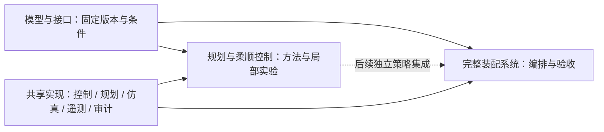

# 研究组织与范围

本项目**以论文复现为基础**：复现 Ren & Shan（2026, Acta Astronautica）的规划—
柔顺控制统一框架（SE(3)-TOPP 规划器 + HQP-AC 控制器）与 Kim et al.
（2025, IEEE T-RO）的 SE(3) 阻抗（§III-A 标称阻抗，§III-B NRIC 未实现），
复现状态逐条对照见[论文对照](paper_mapping.md)。在此基础上适当拓展：几何导向
接口与交互调形工具（[接口交互调形](petal_designer.md)）、绕轴/横向释放两组小型
接触机制实验（[接触阶段控制实验](control_research.md)），以及 HexFrame 完整装配
演示（[系统验证](system_validation.md)）。

仓库按**模型与接口 → 规划与柔顺控制 → 完整装配系统**三层组织。三层是组织与
导航骨架，与 `experiments/` 的目录划分一致，**不是项目的开发顺序**——实际演化
见[项目演化](project_evolution.md)。绘图、遥测、坐标变换与审计为共享支撑。

| 层次 | 定位 | 允许独立变化的因素 | 交付 |
|---|---|---|---|
| 模型与接口（物理基线） | 仿真平台基线：在什么机器人、接口和接触条件下仿真 | 接口轮廓、碰撞表示、模型离散与资格检查条件 | 资产版本、质量惯量、配合定义、物理条件和检查记录 |
| 规划与柔顺控制 | 论文复现核心，加局部控制对照实验 | 方法复现与对照；预声明的绕轴/横向策略；独立误差范围与数值复核 | 协议、同点矩阵、有效配置、评价与失败边界 |
| 完整装配系统（HexFrame） | 完整装配演示与集成验证 | 独立系统扰动、测量/判定策略 | 全流程验收、状态事件、交接审计与同源回放 |

三层各自的定位：

- **模型与接口层是仿真平台基线（research prerequisite，研究前提）**。资格检查证明
  "研究对象明确、双引擎一致、条件已声明"，不用于证明任何控制器的优越性，也不
  强行产生研究问题。
- **规划与柔顺控制层是复现核心加控制实验**：Ren & Shan 的规划—柔顺统一方法、
  Kim et al. 的 SE(3) 标称阻抗，以及检查典型接触行为的绕轴/横向释放小型刚度对照
  实验。方法复现、小型机制实验和完整系统演示应分别归因；方法库不等于系统结果。
- **完整装配系统层是集成验证与演示**。不重新优化算法，只验证已有控制配置进入
  完整抓取—转运—对接—锁定任务后是否仍可工作。HexFrame 整线保留为演示，
  不作为研究对象继续扩展；研究策略的接入属于后续可选工作。

## 初始有效域

固定基座、固定目标、零重力、刚性机械臂与接口。质量惯量、安装变换、关节限制已给定，
仿真用途的一致性检查不能代替实物标定。每组主控制对照固定接口、碰撞、摩擦、接触求解、
轨迹、采样和评价设置。主研究先覆盖 XY 与绕轴偏航估计误差；倾斜、重力、浮动基座分别扩展。

规划与控制使用声明的估计目标及反馈；目标真值、接触标签和止挡状态仅用于评分与显示。
单接口研究终点为稳定落座候选，未模拟锁紧。真实锁紧、制造公差和结构弹性需要独立验证。

## 依赖

算法实现不读取 Demo 布局或阶段常量。研究与模型编排共用单次试验、记录和评价接口；
共享运行库不反向导入实验入口。现有 HexFrame 使用独立关节伺服与接触导纳，
SE(3) 研究策略集成是后续可选工作，不能由目录结构推断已经完成。

## 证据使用

结果优先级：

| 地位 | 内容 | 用途 |
|---|---|---|
| 主结果 | 同点对接完成/卡滞、保持末端误差、完成时间（已有记录可支持时） | 比较控制策略及局限 |
| 辅助结果 | 接触载荷量级、明显冲击、力矩饱和、关节异常 | 排查异常，说明代价 |
| 补充证据 | 步长敏感性、碰撞表示、接口候选 | 解释结论边界，不自动触发新矩阵 |

接触载荷作为辅助观测，精确峰值与模型精细化不作为普遍前置条件。落座状态反转、
策略排序反转、明显数值发散或载荷量级异常时，先做有限代表点诊断，不自动追加
步长/碰撞/摩擦矩阵。

方法实现、已复现结果、项目新增发现分别标注。接口改善、控制改善和系统通过分别归因；
几何研究与控制刚度研究分开归因，两组结果不能互相比较或合并。
不同轮次采用不同工况集合时，不把通过数量连接成成功率曲线。物理步长检查固定控制周期
及反馈延迟；改变采样周期、减速、预紧或搜索均是另一项实验。

历史失败与敏感结果原样保留。新运行使用新目录；历史归档以当时源码与配置解释。
源码指纹变化导致旧目录不可继续或不可复用时明确拒绝，不自动更新阈值或历史哈希。
出处见[历史证据索引](historical_evidence.md)。

下一步：[模型基线](models_interfaces.md)、[论文对照](paper_mapping.md)、
[接触阶段控制实验](control_research.md)、[系统验证](system_validation.md)。
