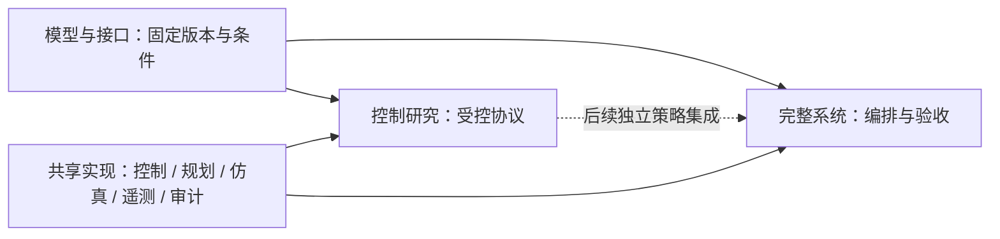

# 研究范围与三层职责

本项目按模型与接口、柔顺控制算法研究、完整对接/装配组织。完整系统承担系统验证和 Demo；
控制结论通过固定模型上的受控实验建立。绘图、遥测、坐标变换与审计为共享支撑。

当前优先研究对接完成、最终误差、效率与失败边界。接触载荷作为辅助观测，
精确峰值与模型精细化不作为普遍前置条件；具体停止条件见[收束决策](research_focus.md)。

| 层次 | 允许独立变化的因素 | 交付 |
|---|---|---|
| 模型与接口 | 接口轮廓、碰撞表示、模型离散与资格检查条件 | 资产版本、质量惯量、配合定义、物理条件和检查记录 |
| 控制研究 | 预声明的绕轴/横向策略；独立误差范围与数值复核 | 协议、同点矩阵、有效配置、评价与失败边界 |
| 完整系统 | 独立系统扰动、测量/判定策略 | 全流程验收、状态事件、交接审计与同源回放 |

## 初始有效域

固定基座、固定目标、零重力、刚性机械臂与接口。质量惯量、安装变换、关节限制已给定，
仿真用途的一致性检查不能代替实物标定。每组主控制对照固定接口、碰撞、摩擦、接触求解、
轨迹、采样和评价设置。主研究先覆盖 XY 与绕轴偏航估计误差；倾斜、重力、浮动基座分别扩展。

规划与控制使用声明的估计目标及反馈；目标真值、接触标签和止挡状态仅用于评分与显示。
单接口研究终点为稳定落座候选，未模拟锁紧。真实锁紧、制造公差和结构弹性需要独立验证。

## 依赖

算法实现不读取 Demo 布局或阶段常量。研究与模型编排共用单次试验、记录和评价接口；
共享运行库不反向导入实验入口。现有 HexFrame 使用独立关节伺服与接触导纳，
SE(3) 研究策略集成是后续工作，不能由目录重构推断已经完成。

## 证据使用

方法实现、已复现结果、项目新增发现分别标注。接口改善、控制改善和系统通过分别归因。
不同轮次采用不同工况集合时，不把通过数量连接成成功率曲线。物理步长检查固定控制周期
及反馈延迟；改变采样周期、减速、预紧或搜索均是另一项实验。

历史失败与敏感结果原样保留。新运行使用新目录；历史归档以当时源码与配置解释。
源码指纹变化导致旧目录不可继续或不可复用时明确拒绝，不自动更新阈值或历史哈希。

下一步：[模型基线](models_interfaces.md)、[控制协议](control_research.md)、[系统验收](system_validation.md)。
